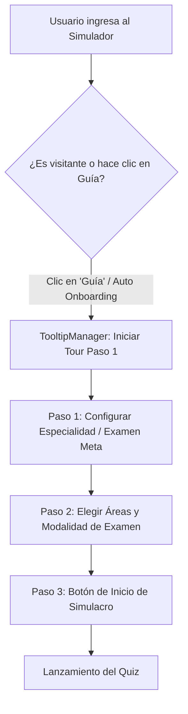

# 🧭 Guía de Usuario y Sistema Centralizado de Tooltips / Onboarding Tour

> **Versión:** 1.0.0  
> **Fecha de Publicación:** 20 de Agosto de 2026  
> **Área:** Presentation Layer / UI Components (`src/presentation/public/js/ui/tooltipManager.js`, `components.css`)  
> **Módulos Vinculados:** Módulo Salud (`MEDICINA`) y Módulo Educación (`EDUCACION`)

---

## 📌 1. Visión General y Justificación

Para garantizar una experiencia de usuario (UX) intuitiva, homogénea y libre de fricciones en **HubAcademia**, se centralizó el sistema de asistencia contextual y guías interactivas.

Anteriormente, existían fragmentos de código huérfanos, scripts aislados y tooltips nativos inconsistentes que provocaban fallos de visibilidad, solapamientos en pantalla o cierres instantáneos. Con la arquitectura centralizada de `TooltipManager`, la plataforma ofrece:

1. **Tooltips Declarativos (Hover/Focus):** Mensajes informativos ultra-rápidos mediante atributos `data-tooltip`.
2. **Onboarding Tour Guiado (3 Pasos):** Recorrido interactivo paso a paso tanto para visitantes (demostración) como para estudiantes registrados en los tableros de **Salud** y **Educación**.
3. **Flujo Estandarizado de Inicio de Simulacro:** Orientación clara sobre cómo configurar especialidades, áreas temáticas, niveles de dificultad y modalidades de examen.



---

## 🏛️ 2. Arquitectura Técnica del Sistema de Tooltips

El sistema está encapsulado en el módulo `tooltipManager.js` y expuesto globalmente como `window.TooltipManager`:

### 📂 Archivos Centrales
* **Lógica JavaScript:** [`src/presentation/public/js/ui/tooltipManager.js`](file:///c:/Users/ricar/Downloads/PROYECTOS/hubacademia/src/presentation/public/js/ui/tooltipManager.js)
* **Estilos y Animaciones CSS:** [`src/presentation/public/css/components.css`](file:///c:/Users/ricar/Downloads/PROYECTOS/hubacademia/src/presentation/public/css/components.css)

### ⚙️ Características Clave de Implementación

| Componente | Especificación Técnica | Beneficio UX |
| :--- | :--- | :--- |
| **Cálculo de Posición** | `getBoundingClientRect()` + `window.scrollX / scrollY` | Posicionamiento milimétrico sin dependencias de librerías pesadas. |
| **Aislamiento de Clics** | `e.stopPropagation()` en botones de navegación | Evita que el tour se cierre por accidente al interactuar con sus botones. |
| **Scroll No Invasivo** | Comprobación previa `isInViewport()` + `block: 'nearest'` | Si el elemento ya está a la vista, **no mueve la pantalla**; si está fuera, desplaza suavemente sin empujar el encabezado hero. |
| **Dimensiones Uniformes** | Ancho fijo de tarjeta `width: 330px;` y botones a `height: 34px;` | Previene que textos como `← Anterior` se partan en 2 líneas. |
| **Persistencia Local** | `localStorage.getItem('hasSeenSimulatorTour')` | Muestra el tour automáticamente solo en la primera visita de un usuario. |

---

## 🩺 3. Flujo de Inicio de Examen: Módulo Salud

El simulador de Salud (`simulator-dashboard.html?context=MEDICINA`) prepara a los postulantes para exámenes de alta exigencia médica en Perú.

### 📋 Pasos para Iniciar un Examen en Salud:
1. **Paso 1: Selección del Examen Meta**
   * El usuario selecciona su convocatoria objetivo: **ENAM** (Examen Nacional de Medicina), **Residentado Médico**, **EsSalud** o **SERUMS**.
2. **Paso 2: Selección de Especialidades y Modalidad**
   * **Filtro Multi-Área:** Puede elegir áreas específicas (ej. *Cardiología*, *Pediatría*, *Ginecología y Obstetricia*, *Cirugía General*) o simulación completa.
   * **Modalidad de Examen:**
     * **Modo Rápido (10 preguntas):** Evaluación ágil para repasar conceptos clave.
     * **Modo Estudio (20 preguntas):** Incluye retroalimentación inmediata, justificación técnica y asistencia del **Tutor IA**.
     * **Simulacro Real (100 preguntas):** Cronómetro estricto de 2 horas (7200s), selección neutral de respuestas y calificación final idéntica al examen oficial.
3. **Paso 3: Ejecución y Finalización**
   * Al responder la última pregunta, el botón cambia dinámicamente a **"Finalizar Simulacro"**.
   * Se abre el modal con la puntuación obtenida y acceso a la **Corrección de Simulacro Médico**, donde las respuestas correctas se destacan en **Verde Cian / Teal (`#0d9488`)**.

---

## 🎓 4. Flujo de Inicio de Examen: Módulo Educación

El simulador de Educación (`simulator-dashboard.html?context=EDUCACION`) está adaptado a las evaluaciones docentes del Ministerio de Educación (MINEDU).

### 📋 Pasos para Iniciar un Examen en Educación:
1. **Paso 1: Selección de la Convocatoria Docente**
   * Selección entre **Nombramiento Docente**, **Ascenso de Escala Magisterial** o **Acceso a Cargos Directivos y Especialistas**.
2. **Paso 2: Selección de Nivel y Especialidad Pedagógica**
   * El docente configura su nivel: **EBR Primaria**, **EBR Secundaria** (con subespecialidades: *Matemática*, *Comunicación*, *Ciencias Sociales*, *Ciencia y Tecnología*), **EBR Inicial**, **EBE** o **EBA**.
   * Selección del modo de evaluación (Rápido, Estudio con Tutor IA o Simulacro Oficial).
3. **Paso 3: Resolución de Casos Pedagógicos y Revisión**
   * Preguntas basadas en casuística pedagógica contextualizada con cuadros y tablas comparativas.
   * Al culminar, la pantalla de **Corrección de Simulacro Magisterial** resalta las alternativas correctas en **Azul Real Magisterial (`#2563eb`)** y provee sustento pedagógico según el Currículo Nacional y guías MINEDU.

---

## 🎯 5. Mapeo de Pasos del Onboarding Tour

El tour está configurado de forma declarativa dentro de `tooltipManager.js`:

```javascript
const tourSteps = [
    {
        target: '#examTargetSelect, #targetSelect, .config-card:first-child',
        title: '1. Elige tu Examen Meta',
        content: 'Selecciona la convocatoria oficial a la que postulas (ENAM, Residentado, Nombramiento o Ascenso).',
        position: 'bottom'
    },
    {
        target: '#areaGrid, #topicSelect, .filter-section',
        title: '2. Configura Áreas y Modo',
        content: 'Personaliza las materias que deseas entrenar o elige un simulacro completo multi-área.',
        position: 'top'
    },
    {
        target: '#btn-start-sim, #btn-start-study-mock, .btn-launch-quiz',
        title: '3. ¡Inicia tu Entrenamiento!',
        content: 'Haz clic aquí para cargar las preguntas oficiales y entrenar con el soporte del Tutor IA.',
        position: 'top'
    }
];
```

---

## 🔔 6. Sistema Centralizado de Alertas y Notificaciones de Vidas

El sistema de feedback al usuario está unificado para prevenir alertas duplicadas o intrusivas durante el entrenamiento:

### 1. Descuento Único de Vida al Iniciar Examen
* **Punto de Descuento:** El consumo de vida en cuentas gratuitas (`Free / Pending`) ocurre **una sola vez** al iniciar el examen (`POST /api/medico/start` o `POST /api/docente/start`).
* **Peticiones de Fondo Inmunes:** Las cargas secundarias de lotes de preguntas (`POST /next-batch`) **no descuentan vidas ni disparan notificaciones**, permitiendo que el estudiante complete el examen sin interrupciones.
* **Notificación Flotante (Toast):**
  * Salta de manera inmediata y no bloqueante con el texto: `⚡ 1 crédito utilizado. Te quedan X/10 vidas de prueba.`
  * Cuando restan 1 o 2 vidas, el sistema alerta preventivamente: `⚠️ ¡Atención! Te quedan solo X/10 vidas de prueba.`

### 2. Consumo de Vidas en Módulo Repaso / Flashcards
El sistema garantiza notificaciones reactivas instantáneas (`⚡ 1 crédito utilizado...`) en todas las acciones de consumo del Centro de Repaso:
* **Estudiar un Mazo / Tarjeta:** Al cargar la cola de tarjetas pendientes (`GET /cards/due` o `GET /study`), el sistema descuenta 1 vida y dispara el toast de feedback.
* **Crear / Clonar / Generar Mazos:** `POST /api/decks` y operaciones de IA descuentan 1 vida con actualización optimista y sincronización en segundo plano.
* **Chat con el Tutor IA de Flashcards:** Cada interacción con `flashcard_tutor` descuenta 1 crédito de prueba y actualiza el contador de la barra superior.

### 3. Botón de Salida Segura y Reanudación de Simulacros (Pausa & Resume)
* **Botón en Cabecera (`#btn-top-exit`):** Ubicado en la esquina superior derecha junto al cronómetro, con diseño minimalista (`.btn-header-exit`), visible en PC y celulares.
* **Guardado Automático de Avance:** Al hacer clic en *"Salir"*, el sistema ejecuta `saveSession()`, persistiendo las preguntas, respuestas contestadas, puntaje parcial y tiempo restante.
* **Diálogo de Confirmación:**
  $$\text{¿Deseas pausar y salir del simulacro? Tu progreso quedará guardado...}$$
* **Reingreso Inteligente:**
  * **Opción "Continuar anterior":** Reanuda exactamente en la pregunta donde se quedó sin perder respuestas ni score acumulado.
  * **Opción "Iniciar nuevo":** Purga la sesión previa (`clearSession()`) y genera un nuevo simulacro desde la pregunta 1 sin mezclar estadísticas.
  * **Sincronización Final:** Al terminar el simulacro, `submitScore()` envía los datos a la base de datos y limpia el caché local automáticamente.

### 4. Modal de Resultados Armoniosa (PC y Celulares)
* Al finalizar el simulacro, el modal `#resultsOverlay` se despliega con su contenedor de acciones `.results-actions` y sub-acciones `.results-secondary-actions`, garantizando un espaciado vertical (`gap: 1.15rem` en PC y `0.95rem` en móviles) sin solapamiento de botones:
  * **Botón Principal:** *"Ver Corrección del Examen"* (`.btn-results-review`, Manta Pill Gradient de altura `48px`).
  * **Botones Secundarios:** *"Salir"* y *"Nuevo Examen"* (`.btn-secondary`, altura uniforme `44px` con iconos).

---

## 💻 7. Guía de Uso Rápido para Desarrolladores

### 1. Activar un Tooltip Sencillo en cualquier elemento HTML
Basta con añadir los atributos `data-tooltip` y opcionalmente `data-tooltip-pos`:
```html
<button class="btn-action" data-tooltip="Consultar explicación con IA" data-tooltip-pos="top">
    <i class="fas fa-robot"></i>
</button>
```

### 2. Disparar el Tour Guiado Programáticamente
```javascript
// Iniciar el tour forzando el paso 1 (ideal para botones de ayuda o 'Guía')
window.TooltipManager.startSimulatorTour(true);
```

### 3. Cerrar cualquier Tooltip o Tour Activo
```javascript
window.TooltipManager.hide();
```

---

## 🔗 8. Matriz de Documentación UI/UX Centralizada

Para evitar duplicación y mantener la verdad técnica del proyecto:
* 📖 [UI_COMPONENTS_GUIDE.md](file:///c:/Users/ricar/Downloads/PROYECTOS/hubacademia/documentation/UI_COMPONENTS_GUIDE.md): Catálogo exhaustivo de APIs y componentes Frontend (`UIManager`, `ConfirmationModal`, `Components.js`).
* 🎨 [DESIGN_SYSTEM.md](file:///c:/Users/ricar/Downloads/PROYECTOS/hubacademia/documentation/DESIGN_SYSTEM.md): Especificación visual maestra de tokens CSS, paletas Manta, temas oscuro/claro y glassmorphism.
* 🧭 [GUIA_USUARIO_Y_TOOLTIPS.md](file:///c:/Users/ricar/Downloads/PROYECTOS/hubacademia/documentation/GUIA_USUARIO_Y_TOOLTIPS.md): Flujos de usuario, Onboarding Tour y alertas contextuales por módulo.

---

## 🧪 9. Criterios de Aceptación y Calidad (QA)

- [x] **Alerta Única de Vida:** El toast de descuento de vida se dispara exactamente una vez al pulsar iniciar simulacro y nunca en las preguntas subsiguientes o cargas de batch.
- [x] **Modal de Resultados Armonioso:** Espaciado limpio entre *"Ver Corrección del Examen"* y los botones de acción inferior tanto en PC como en pantallas táctiles de 360px-480px.
- [x] **Sin Solapamientos en Tour:** La tarjeta del tooltip nunca obstruye botones críticos ni se desborda fuera de la pantalla en dispositivos móviles.
- [x] **Navegación Fluida:** Los botones `← Anterior`, `Siguiente →` y `¡Comenzar! 🚀` tienen tamaño idéntico (`34px` de alto) y no sufren saltos de línea.
- [x] **Identidad Visual por Módulo:** Coherencia de colores temáticos (Salud = Verde Cian / Educación = Azul Royal) en el quiz y en la revisión.
