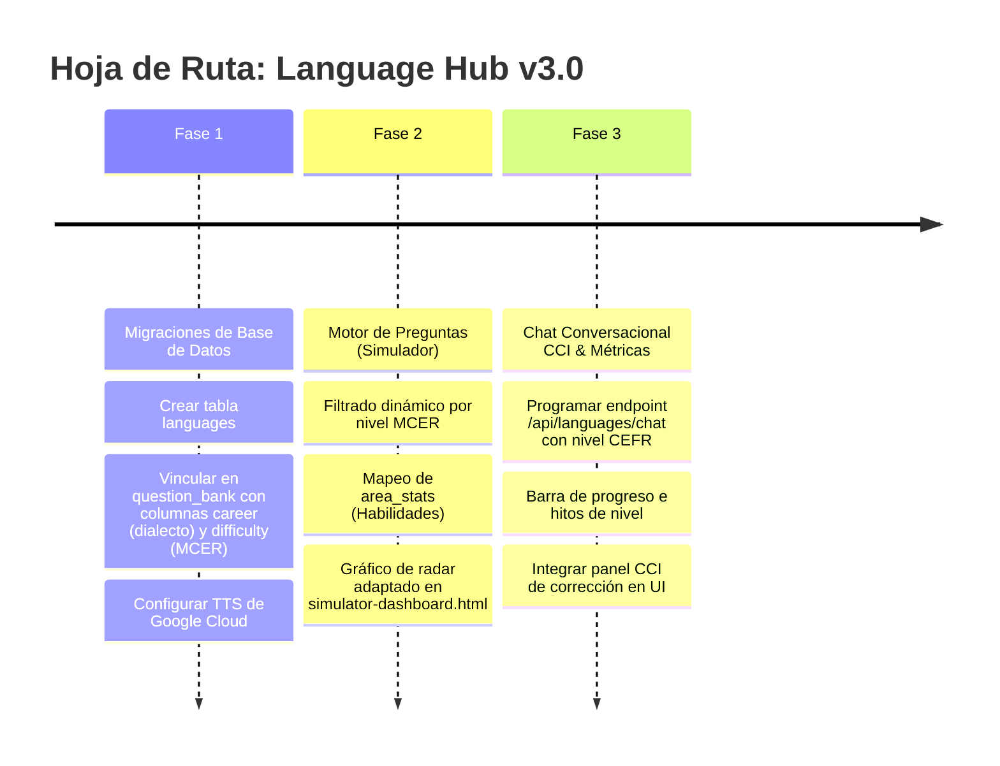

# 🌎 Especificación Técnica y UX: Módulo de Idiomas (Language Hub)

> **Última actualización:** 2026-05-23  
> **Estado:** ⚡ En Producción y Expansión - V3.1 (Syllabus & Vocabulario)  
> **Área:** Expansión Multi-Dominio (Hub Academia v3.0)  
> **Autor:** Antigravity AI  

---

## 1. 🎯 Introducción y Alcance Multi-Idioma [COMPLETED]

El **Módulo de Idiomas (Language Hub)** de Hub Academia v3.0 es una plataforma de entrenamiento diseñada no solo para impartir lenguas genéricas, sino para ofrecer especializaciones de dialectos, variantes y gramática adaptadas a las necesidades reales del estudiante. 

### 1.1 Variantes y Lenguas Soportadas
*   **English (USA) [en-US]:** Enfoque en pronunciación norteamericana, giros idiomáticos corporativos de Silicon Valley, y ortografía estándar americana (ej. *color, analyze*).
*   **English (UK) [en-GB]:** Enfoque en exámenes oficiales (Cambridge, IELTS), pronunciación británica y ortografía británica estándar (ej. *colour, analyse*).
*   **Italiano (IT) [it-IT]:** Enfoque en estructuras de género, concordancia gramatical, registro formal (*tu* vs. *Lei*), y conjugaciones complejas.
*   **Escalabilidad a Futuro:** El sistema está diseñado modularmente para añadir variantes y lenguas adicionales (ej. *Português, Français, Deutsch*) simplemente registrando sus códigos de idioma ISO y voces TTS en la base de datos sin alterar el motor principal.

---

## 2. 🔍 Integración de Elementos de Plataformas Líderes [COMPLETED]

El Language Hub combina las mejores características de las plataformas de idiomas más exitosas del mercado, adaptándolas a un contexto profesional y técnico:

```
┌─────────────────────────────────────────────────────────────────────────┐
│                          ELEMENTOS INTEGRADOS                           │
├────────────────────┬────────────────────┬───────────────────────────────┤
│    DE DUOLINGO     │    DE ELSA SPEAK   │     DE ENGLISH FOR IT         │
├────────────────────┼────────────────────┼───────────────────────────────┤
│ • Repetición       │ • Diálogos libres  │ • Lógica constructivista      │
│   Espaciada (SRS)  │   por voz (STT)    │   de programación aplicada    │
│ • Gamificación de  │ • Simulación de    │ • Cloze Tests en escenarios   │
│   "Vidas" (Free)   │   escenarios de    │   reales (Slack, Jira, PRs)   │
│ • Traducción       │   negocios/tech    │ • Foco en activar el          │
│   Contextual L2-L1 │ • Feedback de      │   vocabulario técnico pasivo  │
│   en Flashcards    │   corrección oral  │ • Énfasis en falsos amigos    │
└────────────────────┴────────────────────┴───────────────────────────────┘
```

---

## 3. 📊 Niveles de Idioma (MCER / CEFR) en la Web [COMPLETED]

La mayoría de las plataformas web estructuran sus cursos bajo el **MCER (Marco Común Europeo de Referencia para las lenguas)**, el estándar internacional que divide el aprendizaje en 6 niveles:

*   **Bloque A (Usuario Básico):**
    *   **A1 (Acceso):** Interacciones simples cotidianas, vocabulario elemental.
    *   **A2 (Plataforma):** Frases sencillas de relevancia inmediata (información personal, compras, geografía).
*   **Bloque B (Usuario Independiente):**
    *   **B1 (Umbral):** Comprensión de puntos principales sobre temas de trabajo/estudio. Capacidad de producir textos sencillos sobre temas familiares.
    *   **B2 (Avanzado):** Comprensión de textos técnicos complejos. Fluidez suficiente para conversar con hablantes nativos sin tensión.
*   **Bloque C (Usuario Competente):**
    *   **C1 (Dominio Operativo Eficaz):** Comprensión de textos extensos y exigentes, reconocimiento de sentidos implícitos. Uso flexible del idioma para fines sociales, académicos y profesionales.
    *   **C2 (Maestría):** Comprensión total y facilidad para expresarse con fluidez y precisión, distinguiendo pequeños matices de significado.

### 3.1 ¿Cómo lo manejan los líderes?
*   **Duolingo (Curricular Implícito):** Estructura su ruta lineal basada en el MCER (secciones correspondientes a A1-B2), pero **oculta** las etiquetas técnicas para no asustar al usuario casual, usando en su lugar nombres temáticos (ej. "Hablar de planes").
*   **Babbel y Busuu (Curricular Explícito):** Muestran las etiquetas MCER claramente desde el inicio (ej. "Curso de Italiano A2"), ya que su público es más profesional y busca hitos académicos o certificaciones.
*   **ELSA Speak (Métrica de Desempeño Adaptativa):** Evalúa mediante un test de diagnóstico inicial y estima un nivel CEFR equivalente o puntuación de examen internacional (IELTS/TOEFL), adaptando dinámicamente las misiones al nivel del usuario.

### 3.2 Implementación en Hub Academia
Hub Academia adopta un enfoque **Híbrido y Explícito**, idóneo para estudiantes universitarios y profesionales técnicos:
1.  **Selector de Nivel de Destino:** En el modal de configuración del Simulador y en el Chat Conversacional (CCI), el usuario puede elegir activamente su nivel objetivo: **A1, A2, B1, B2 o C1/C2**.
2.  **Inyección en Prompt de Gemini:** El nivel seleccionado se envía a la API para que Gemini restrinja su vocabulario, velocidad sintáctica y tipos de errores que corrige (ej. no exigir modismos avanzados C1 a un estudiante A2).
3.  **Preguntas en Banco Local:** La columna `difficulty` de la tabla `question_bank` se mapeará directamente con los niveles MCER (`A1`, `A2`, `B1`, `B2`, `C1`, `C2`).

---

## 4. 📈 Medición del Progreso y Rendimiento [COMPLETED]

> [!NOTE]
> **Estado de Implementación (Medición de Progreso):**
> - **SRS Donut & Heatmap:** Integrado a través del Módulo de Repaso (`repaso.html`), enlazado dinámicamente desde el KPI "Tarjetas Dominadas" en el dashboard.
> - **Gráficos de Habilidades:** Las 4 áreas se renderizan en formato de gráfico de barras nativas agrupadas en el frontend.
> - **Equivalencia de Exámenes:** Totalmente integrado en la UI del Dashboard. Muestra de forma dinámica la estimación del nivel CEFR (A1-C2) y sus equivalentes oficiales en TOEFL/IELTS/CELI/CILS según el promedio obtenido en los simulacros.

El usuario medirá su avance mediante cuatro sistemas integrados en el **Dashboard de Idiomas**:

### 4.1 Estado del Vocabulario (SRS Donut & Heatmap)
Utiliza el motor de flashcards actual. El usuario visualiza:
*   **Métrica de Retención:** Gráfico de anillo desglosando tarjetas de idiomas en *Nuevas*, *En Aprendizaje* y *Dominadas*.
*   **Heatmap de Consistencia:** Mapa de calor de días consecutivos repasando vocabulario.

### 4.2 Radar de las 4 Habilidades Lingüísticas (Quiz Engine)
Mide el rendimiento en simulacros y exámenes mediante el gráfico de radar SVG basado en la columna JSONB `area_stats`:
*   **Grammar & Use of English:** Precisión en conjugación, tiempos verbales y estructuras sintácticas.
*   **Vocabulary & Context:** Elección de palabras en situaciones técnicas o profesionales.
*   **Reading Comprehension:** Comprensión de textos técnicos o emails corporativos.
*   **Listening Comprehension:** Comprensión auditiva de audios reproducidos por el TTS.

### 4.3 Equivalencia con Exámenes Internacionales
El sistema mapea el puntaje acumulado en el simulador a puntajes de exámenes oficiales:

```
[ Promedio General del Simulador ] ──► [ Nivel MCER Estimado ] ──► [ Equivalencia de Examen ]
       Ej: 14/20 (70%)                     Ej: B2                     IELTS: 5.5 - 6.5
                                                                      TOEFL: 72 - 94
```

### 4.4 Barra de Nivel y Hitos de Módulos
Barra de progreso visual que muestra el avance en el currículo seleccionado (ej. *"Completado: 65% de Inglés Técnico B1"*).

---

## 5. 💬 Chat Conversacional de Idiomas (CCI) [COMPLETED]

### 5.1 Aislamiento de la Interfaz
El **Chat Conversacional de Idiomas (CCI)** es una herramienta empotrada dentro de la interfaz del Módulo de Idiomas.
*   **Acceso:** Panel lateral o pestaña dedicada en `languages-dashboard.html`.
*   **Independencia:** No comparte base de datos de mensajes ni historial con el chat médico/educativo general. Sus hilos de conversación son efímeros y específicos por sesión de práctica.

### 5.2 El Bucle de Corrección Gramatical y Fluidez
El CCI analiza el input del usuario en tiempo real y realiza una corrección gramatical y de orden de palabras antes de continuar el diálogo.

```
       [ Input del Usuario (L2) ] ──► "I have 25 years and I live in Rome since 2 years."
                   │
                   ▼
       [ Inferencia de Gemini 2.5 ]
                   │
         ┌─────────┴────────────────────────────────────────┐
         ▼ (Análisis Gramatical)                            ▼ (Continuidad del Diálogo)
   Grammar & Word Order Check                         Respuesta contextual en L2
   - Error: "I have 25 years"                         - "That's great! Rome is a beautiful
   - Corrección: "I am 25 years old"                  city. What do you do there?"
   - Error: "since 2 years"                           
   - Corrección: "for 2 years"
                   │
                   ▼
       [ Renderizado en Frontend (CCI) ]
       ┌────────────────────────────────────────────────────────┐
       │ 💡 **Language Correction:**                            │
       │ *   *Original:* "I **have** 25 years..."                │
       │ *   *Corrected:* "I **am** 25 years old..."             │
       │ *   *Why:* In English, we express age using 'to be'.   │
       │ *   *Original:* "...**since** 2 years."                │
       │ *   *Corrected:* "...**for** 2 years."                  │
       │ *   *Why:* Use 'for' for durations of time.            │
       │ ────────────────────────────────────────────────────── │
       │ Oh, Rome is a beautiful city! What do you do there?... │
       └────────────────────────────────────────────────────────┘
```

---

## 6. 🛠️ Diseño Técnico de la Propuesta [COMPLETED]

### 6.1 Definición de Targets e Identificación en Backend
Para mantener coherencia con `MODULO_EDUCACION_TECH_SPECS.md`, mapearemos dinámicamente los targets en `idiomasSimulatorService.js`:

```javascript
const LANGUAGE_TARGETS = ['TOEFL', 'IELTS', 'TECH_ENGLISH'];

// Enrutamiento de Dominio en el Backend
const isLanguage = LANGUAGE_TARGETS.includes(target);
const dbDomain = isLanguage ? 'languages' : (isEducation ? 'education' : 'medicine');
```

### 6.2 Estructura del Desglose en `area_stats` (JSONB)
Cuando el usuario finaliza un simulacro de idiomas, el backend persistirá los resultados de esta forma:

```json
{
  "Grammar & Use of English": {
    "correct": 8,
    "total": 10,
    "percentage": 80
  },
  "Vocabulary & Context": {
    "correct": 7,
    "total": 10,
    "percentage": 70
  },
  "Reading Comprehension": {
    "correct": 4,
    "total": 5,
    "percentage": 80
  },
  "Listening Comprehension": {
    "correct": 3,
    "total": 5,
    "percentage": 60
  }
}
```

### 6.3 Configuración de Idiomas en Base de Datos (Evolución de Esquemas)

Se define la tabla `languages` para orquestar los idiomas y motores de voz disponibles:

```sql
CREATE TABLE IF NOT EXISTS public.languages (
    id SERIAL PRIMARY KEY,
    code VARCHAR(10) UNIQUE NOT NULL, -- 'en-US', 'en-GB', 'it-IT', 'fr-FR'
    name VARCHAR(50) NOT NULL,        -- 'English (USA)', 'English (UK)', 'Italiano'
    tts_voice VARCHAR(50) NOT NULL,   -- Voz neural de Google Cloud TTS
    is_active BOOLEAN DEFAULT TRUE,
    created_at TIMESTAMP WITH TIME ZONE DEFAULT CURRENT_TIMESTAMP
);

-- Inserción de Idiomas Iniciales
INSERT INTO public.languages (code, name, tts_voice) VALUES 
('en-US', 'English (USA)', 'en-US-Neural2-F'),
('en-GB', 'English (UK)', 'en-GB-Neural2-F'),
('it-IT', 'Italiano', 'it-IT-Neural2-A')
ON CONFLICT (code) DO UPDATE SET tts_voice = EXCLUDED.tts_voice;
```

#### Vinculación en `question_bank`
Las preguntas de idiomas se insertarán en la tabla `question_bank` utilizando la columna `career` para especificar el dialecto o variante, y `difficulty` para el nivel MCER:

```sql
-- Pregunta para English (UK) nivel B2
INSERT INTO question_bank (
  domain, target, career, topic, subtopic, question_text, 
  options_json, correct_option, explanation, difficulty
) VALUES (
  'languages', 
  'TECH_ENGLISH', 
  'en-GB',                     -- Variante / Dialecto
  'Grammar & Use of English', 
  'Spelling differences',
  'Please ensure you ________ your team tasks regularly to avoid blockers.',
  '["prioritise", "prioritize", "prioritises", "prioritizes"]'::jsonb,
  'prioritise',
  'En inglés británico (en-GB), el sufijo correcto es "-ise". La palabra correcta es "prioritise".',
  'B2'                         -- Nivel MCER
);
```

### 6.4 Endpoint y Orquestación del CCI (`LanguagueChatController.js`)
El backend del chat integrado de idiomas (`POST /api/languages/chat`) procesa el mensaje del usuario e invoca a Gemini utilizando un prompt enriquecido con las reglas del idioma y el nivel objetivo actual del usuario:

```javascript
function buildLaciPrompt(languageCode, cefrLevel) {
  return `
    Eres un Tutor Conversacional nativo especializado en la variante de idioma: [${languageCode}] y adaptado al nivel de estudiante MCER [${cefrLevel}].
    Tu objetivo es mantener un diálogo natural y fluido, pero analizando de forma estricta la gramática, conjugación y el orden de palabras del usuario.
    
    REGLAS SEGÚN NIVEL DE ESTUDIANTE [${cefrLevel}]:
    - Si el nivel es A1-A2: Utiliza oraciones cortas, vocabulario simple, velocidad sintáctica baja y corrige con paciencia errores básicos (ej. pronombres, verbos en presente).
    - Si el nivel es B1-B2: Utiliza oraciones moderadamente complejas, incluye terminología profesional y corrige errores de tiempos perfectos, preposiciones y falsos amigos.
    - Si el nivel es C1-C2: Mantén una conversación al nivel de un colega nativo, exige el uso de phrasal verbs, modismos complejos y corrige sutiles errores de entonación escrita o formalidad.
    
    INSTRUCCIONES DE RESPUESTA:
    1. Analiza el último mensaje del usuario.
    2. Si detectas errores de gramática, vocabulario o estructura según su nivel [${cefrLevel}], completa la sección "correcciones" en el JSON de salida con el texto original, el corregido y una justificación breve en español.
    3. Si el mensaje es correcto, la lista de "correcciones" debe estar vacía.
    4. En la propiedad "respuesta", continúa la conversación de forma amigable y en el idioma de práctica (L2). Haz una pregunta corta al final para mantener el flujo.
    
    RESPONDE ÚNICAMENTE CON EL SIGUIENTE FORMATO JSON:
    {
      "correcciones": [
        {
          "original": "texto con error",
          "corregido": "texto corregido",
          "explicacion": "explicación en español de la regla rota"
        }
      ],
      "respuesta": "Tu respuesta en el idioma de práctica continuando la conversación."
    }
  `;
}
```

---

## 7. 🎨 Diseño de la Interfaz del Chat (CCI) en el Dashboard [COMPLETED]

El Chat Conversacional se embebe como una tarjeta o pestaña interactiva con un diseño moderno glassmórfico:

```html
<!-- Componente del Chat Conversacional de Idiomas (CCI) -->
<div class="cci-container glass-card">
  <div class="cci-header">
    <div class="cci-tutor-info">
      <div class="avatar-glow active-pulse">🇮🇹</div>
      <div>
        <h4>Tutor Conversacional</h4>
        <span class="status-text">Practicando Italiano (it-IT)</span>
      </div>
    </div>
    <div class="cci-selectors">
      <!-- Selector de Idioma -->
      <select id="cci-language-selector" class="cci-select">
        <option value="en-US">🇺🇸 English (USA)</option>
        <option value="en-GB">🇬🇧 English (UK)</option>
        <option value="it-IT" selected>🇮🇹 Italiano</option>
      </select>
      <!-- Selector de Nivel MCER -->
      <select id="cci-cefr-selector" class="cci-select">
        <option value="A1">A1 (Principiante)</option>
        <option value="A2">A2 (Básico)</option>
        <option value="B1">B1 (Intermedio)</option>
        <option value="B2">B2 (Intermedio Alto)</option>
        <option value="C1">C1 (Avanzado)</option>
      </select>
    </div>
  </div>
  
  <div class="cci-messages-box" id="cci-messages">
    <!-- Mensaje del bot con bloque de corrección -->
    <div class="cci-message bot-msg">
      <div class="cci-correction-card">
        <h5>💡 Language Correction</h5>
        <div class="correction-item">
          <span class="tag-wrong">Original:</span> <code class="txt-wrong">"Io ho andato a Roma"</code>
        </div>
        <div class="correction-item">
          <span class="tag-right">Corrected:</span> <code class="txt-right">"Sono andato a Roma"</code>
        </div>
        <p class="correction-explanation"><strong>Explicación:</strong> En italiano, los verbos de movimiento utilizan el auxiliar 'essere' (sono) en lugar de 'avere' (ho).</p>
      </div>
      <div class="cci-message-text">
        Che bello! Roma è una città meravigliosa. Ci sei andato per lavoro o per vacanza?
      </div>
    </div>
  </div>

  <div class="cci-input-bar">
    <input type="text" id="cci-input" placeholder="Escribe en italiano..." />
    <button class="btn-mic" id="cci-mic"><i class="fa fa-microphone"></i></button>
    <button class="btn-send" id="cci-send"><i class="fa fa-paper-plane"></i></button>
  </div>
</div>
```

---

## 8. 🗺️ Plan de Implementación de Idiomas (V3.0) [COMPLETED]

El desarrollo del módulo se estructurará de forma paralela en el backend y frontend:



---

## 9. 🗺️ Plan de Expansión (V3.1): Temario Interactivo y Constructor de Vocabulario [COMPLETED]

Para ampliar la propuesta del Language Hub y dotarlo de mayor valor educativo, la versión 3.1 incorpora las siguientes dos subsecciones funcionales en la barra de pestañas:

### 9.1 Temario Interactivo Asistido por IA (Syllabus Hub)
Permite al estudiante seguir una ruta curricular formal por niveles (A1-C2).
*   **Contenidos Estructurados:** Una tabla (`languages_syllabus`) que cataloga unidades y temas específicos por variante gramatical e idioma.
*   **Clases Teóricas Generadas:** Al ingresar a un tema, Gemini elabora una lección con conceptos teóricos resumidos, reglas gramaticales clave, ejemplos prácticos (con audio tts premium) y errores recurrentes.
*   **Chat con Tutor de Lección:** Panel conversacional embebido exclusivo para hacer consultas al bot sobre el tema en desarrollo.
*   **Quiz de Hitos:** Evaluación rápida de 3 preguntas para marcar el tema como "Aprobado" y actualizar la barra de progreso en base de datos.

### 9.2 Constructor y Gestor de Vocabulario (Vocabulary Builder)
Un repositorio personalizado de palabras y frases para cada estudiante.
*   **Autocompletado Gemini:** El usuario solo digita la palabra en inglés/italiano y hace clic en "Completar con IA". El bot auto-rellena su traducción, definición en español/inglés adaptada al nivel y una oración modelo.
*   **TTS y Caché en GCS:** Al guardar la palabra, se sintetiza la pronunciación del vocablo en el idioma objetivo y se guarda en el bucket de GCS (`audio_url`).
*   **Exportador Rápido a Flashcards SRS:** Selección y conversión de palabras a tarjetas de repaso (`user_flashcards`), manteniendo el audio premium y enlazándolo con el módulo global de repaso.

---

## 10. 🔌 Desacoplamiento e Independización del Tutor Conversacional IA (V3.2) [COMPLETED]

Con el fin de evitar la contaminación de configuraciones entre el simulador de certificaciones TOEFL/IELTS y el chat conversacional interactivo, en la versión 3.2 se implementó un desacoplamiento arquitectónico integral:

### 10.1 Aislamiento de Ruta y Vistas (Clean URLs)
*   **Página Física Dedicada:** Se extrajo el chat de `simulator-dashboard.html` y se creó la página física independiente [language-tutor.html](file:///C:/Users/ricar/Downloads/PROYECTOS/hubacademia/src/presentation/public/language-tutor.html).
*   **Ruta Limpia de Producción:** Servida a través del enrutador de Express en `/language-tutor` sin la extensión `.html` y con la reescritura de URLs correspondiente en Vercel para producción.
*   **Estilos Propios:** Hojas de estilo dedicadas en [language-tutor.css](file:///C:/Users/ricar/Downloads/PROYECTOS/hubacademia/src/presentation/public/css/language-tutor.css) siguiendo las especificaciones de [DESIGN_SYSTEM.md](file:///C:/Users/ricar/Downloads/PROYECTOS/hubacademia/documentation/DESIGN_SYSTEM.md).

### 10.2 Aislamiento de Estado y Configuración Volátil
*   **Clave Aislada:** Las selecciones del idioma (en-US, en-GB, it-IT) y nivel (A1-C2) en el chat se persisten de forma aislada en la clave `langTutorConfig` de `localStorage`.
*   **No Contaminación:** Se garantiza que cualquier cambio en las preferencias del chat interactivo no altere la configuración de exámenes activos (`simActiveConfig_IDIOMAS`), resolviendo condiciones de carrera y mezclas de datos.

### 10.3 Patrón para Futuros Módulos Especializados
Este diseño sienta las bases de arquitectura desacoplada para los próximos simuladores interactivos de los otros módulos:
*   **Salud/Médico:** *Diagnóstico por Imágenes* y *Casos Clínicos de Diagnóstico con IA* se diseñarán con vistas físicas, scripts y hojas de estilo independientes de la base de exámenes SERUMS/ENAM.
*   **Docente/Educación:** El *Creador de Sesiones de Clase* y el *Generador de Rúbricas* tendrán sus propios flujos y controladores de datos privados, protegiendo la meta de simulacros nacionales.

---
**Autor:** Antigravity AI  
**Documento de Diseño de UX, Mercado y Expansión v3.2** 🌎✨
