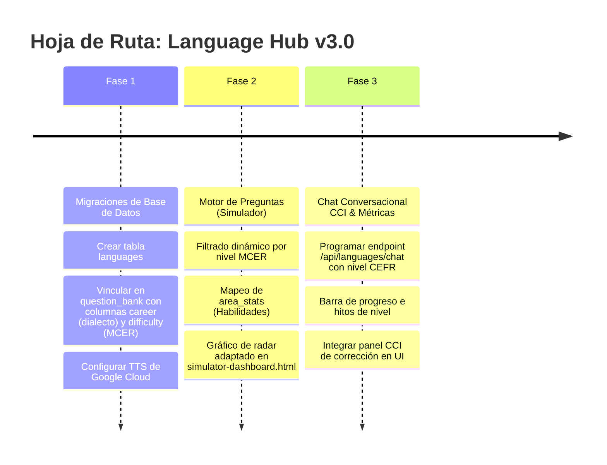

# 🌎 Especificación Técnica y UX: Módulo de Idiomas (Language Hub)

> **Última actualización:** 2026-05-23  
> **Estado:** ⚡ En Producción y Expansión - V3.1 (Syllabus & Vocabulario)  
> **Área:** Expansión Multi-Dominio (Hub Academia v3.0)  
> **Autor:** Antigravity AI  

---

## 1. 🎯 Introducción y Alcance Multi-Idioma [COMPLETED]

El **Módulo de Idiomas (Language Hub)** de Hub Academia v3.0 es una plataforma de entrenamiento diseñada no solo para impartir lenguas genéricas, sino para ofrecer especializaciones de dialectos, variantes y gramática adaptadas a las necesidades reales del estudiante. 

### 1.1 Variantes y Lenguas Soportadas
*   **English (USA) [en-US]:** Enfoque en pronunciación norteamericana, giros idiomáticos corporativos de Silicon Valley, y ortografía estándar americana (ej. *color, analyze*).
*   **English (UK) [en-GB]:** Enfoque en exámenes oficiales (Cambridge, IELTS), pronunciación británica y ortografía británica estándar (ej. *colour, analyse*).
*   **Italiano (IT) [it-IT]:** Enfoque en estructuras de género, concordancia gramatical, registro formal (*tu* vs. *Lei*), y conjugaciones complejas.
*   **Escalabilidad a Futuro:** El sistema está diseñado modularmente para añadir variantes y lenguas adicionales (ej. *Português, Français, Deutsch*) simplemente registrando sus códigos de idioma ISO y voces TTS en la base de datos sin alterar el motor principal.

---

## 2. 🔍 Integración de Elementos de Plataformas Líderes [COMPLETED]

El Language Hub combina las mejores características de las plataformas de idiomas más exitosas del mercado, adaptándolas a un contexto profesional y técnico:

```
┌─────────────────────────────────────────────────────────────────────────┐
│                          ELEMENTOS INTEGRADOS                           │
├────────────────────┬────────────────────┬───────────────────────────────┤
│    DE DUOLINGO     │    DE ELSA SPEAK   │     DE ENGLISH FOR IT         │
├────────────────────┼────────────────────┼───────────────────────────────┤
│ • Repetición       │ • Diálogos libres  │ • Lógica constructivista      │
│   Espaciada (SRS)  │   por voz (STT)    │   de programación aplicada    │
│ • Gamificación de  │ • Simulación de    │ • Cloze Tests en escenarios   │
│   "Vidas" (Free)   │   escenarios de    │   reales (Slack, Jira, PRs)   │
│ • Traducción       │   negocios/tech    │ • Foco en activar el          │
│   Contextual L2-L1 │ • Feedback de      │   vocabulario técnico pasivo  │
│   en Flashcards    │   corrección oral  │ • Énfasis en falsos amigos    │
└────────────────────┴────────────────────┴───────────────────────────────┘
```

---

## 3. 📊 Niveles de Idioma (MCER / CEFR) en la Web [COMPLETED]

La mayoría de las plataformas web estructuran sus cursos bajo el **MCER (Marco Común Europeo de Referencia para las lenguas)**, el estándar internacional que divide el aprendizaje en 6 niveles:

*   **Bloque A (Usuario Básico):**
    *   **A1 (Acceso):** Interacciones simples cotidianas, vocabulario elemental.
    *   **A2 (Plataforma):** Frases sencillas de relevancia inmediata (información personal, compras, geografía).
*   **Bloque B (Usuario Independiente):**
    *   **B1 (Umbral):** Comprensión de puntos principales sobre temas de trabajo/estudio. Capacidad de producir textos sencillos sobre temas familiares.
    *   **B2 (Avanzado):** Comprensión de textos técnicos complejos. Fluidez suficiente para conversar con hablantes nativos sin tensión.
*   **Bloque C (Usuario Competente):**
    *   **C1 (Dominio Operativo Eficaz):** Comprensión de textos extensos y exigentes, reconocimiento de sentidos implícitos. Uso flexible del idioma para fines sociales, académicos y profesionales.
    *   **C2 (Maestría):** Comprensión total y facilidad para expresarse con fluidez y precisión, distinguiendo pequeños matices de significado.

### 3.1 ¿Cómo lo manejan los líderes?
*   **Duolingo (Curricular Implícito):** Estructura su ruta lineal basada en el MCER (secciones correspondientes a A1-B2), pero **oculta** las etiquetas técnicas para no asustar al usuario casual, usando en su lugar nombres temáticos (ej. "Hablar de planes").
*   **Babbel y Busuu (Curricular Explícito):** Muestran las etiquetas MCER claramente desde el inicio (ej. "Curso de Italiano A2"), ya que su público es más profesional y busca hitos académicos o certificaciones.
*   **ELSA Speak (Métrica de Desempeño Adaptativa):** Evalúa mediante un test de diagnóstico inicial y estima un nivel CEFR equivalente o puntuación de examen internacional (IELTS/TOEFL), adaptando dinámicamente las misiones al nivel del usuario.

### 3.2 Implementación en Hub Academia
Hub Academia adopta un enfoque **Híbrido y Explícito**, idóneo para estudiantes universitarios y profesionales técnicos:
1.  **Selector de Nivel de Destino:** En el modal de configuración del Simulador y en el Chat Conversacional (CCI), el usuario puede elegir activamente su nivel objetivo: **A1, A2, B1, B2 o C1/C2**.
2.  **Inyección en Prompt de Gemini:** El nivel seleccionado se envía a la API para que Gemini restrinja su vocabulario, velocidad sintáctica y tipos de errores que corrige (ej. no exigir modismos avanzados C1 a un estudiante A2).
3.  **Preguntas en Banco Local:** La columna `difficulty` de la tabla `question_bank` se mapeará directamente con los niveles MCER (`A1`, `A2`, `B1`, `B2`, `C1`, `C2`).

### 3.3 Propósito Pedagógico y Contextual de los Exámenes Objetivos
Para brindar un entrenamiento dirigido de alto valor, Hub Academia clasifica y orienta cada simulador de exámenes según objetivos lingüísticos, académicos o profesionales:

#### A. Exámenes para Inglés (en-US / en-GB)
*   **MCER (CEFR) [General English]:**
    *   *Propósito:* Evaluar el dominio lingüístico general para la comunicación cotidiana.
    *   *Enfoque:* Situaciones del día a día, modismos neutros, gramática base (tiempos verbales comunes, preposiciones) y lecturas informativas de interés general.
*   **TOEFL [Academic English]:**
    *   *Propósito:* Preparación para entornos universitarios de habla inglesa (principalmente de Norteamérica).
    *   *Enfoque:* Vida en el campus, clases teóricas (lectures), diálogos de secretaría de estudios, lecturas de divulgación científica y vocabulario de nivel académico superior.
*   **IELTS [Academic & General Training]:**
    *   *Propósito:* Preparación para trámites de migración, residencia o ingreso a universidades británicas y de la Commonwealth.
    *   *Enfoque:* Comprensión factual detallada, interpretación de datos lógicos, textos informativos más estructurados y un registro formal alineado al estilo de Cambridge.
*   **Inglés Técnico (TECH_ENGLISH) [Professional English]:**
    *   *Propósito:* Desarrollar habilidades lingüísticas para el entorno de la ingeniería, TI y desarrollo de software.
    *   *Enfoque:* Escenarios de trabajo (juntas de Scrum, code reviews, Slack corporativo), redacción de tickets de Jira y pull requests, lectura de especificaciones de APIs y vocabulario técnico del sector.

> [!TIP]
> **Diferenciación de Ortografía y Dialecto:**  
> - Si el dialecto seleccionado es **Inglés USA (`en-US`)**, la IA utilizará ortografía americana (ej. *analyze, color*) y modismos norteamericanos.  
> - Si el dialecto es **Inglés UK (`en-GB`)**, la IA cambiará automáticamente a ortografía británica (ej. *analyse, colour*) y modismos de la Commonwealth.

#### B. Exámenes para Italiano (it-IT)
*   **MCER [Italiano Generale]:**
    *   *Propósito:* Desarrollar soltura en el uso diario del italiano.
    *   *Enfoque:* Conjugación verbal general, concordancia de género y número (*accordo di genere e numero*), uso correcto de artículos y preposiciones articuladas en contextos cotidianos.
*   **CELI [Italiano Accademico]:**
    *   *Propósito:* Preparación para el ingreso a universidades y el ejercicio profesional formal en Italia (certificación de la *Università per Stranieri di Perugia*).
    *   *Enfoque:* Comprensión de textos formales, literarios o periodísticos complejos. Evaluaciones de gramática avanzada, sintaxis compleja (pronombres combinados y subjuntivo *congiuntivo*) y registro culto.
*   **CILS [Italiano Pratico ed Immigrazione]:**
    *   *Propósito:* Preparación para trámites de ciudadanía (como el examen CILS B1 Cittadinanza), residencia o inserción laboral básica (certificación de la *Università per Stranieri di Siena*).
    *   *Enfoque:* Situaciones cívicas y funcionales, lectura de letreros, anuncios de transporte público, formularios oficiales de oficina, correspondencia comercial simple y temas de cultura civil italiana.

---

## 4. 📈 Medición del Progreso y Rendimiento [COMPLETED]

> [!NOTE]
> **Estado de Implementación (Medición de Progreso):**
> - **SRS Donut & Heatmap:** Integrado a través del Módulo de Repaso (`repaso.html`), enlazado dinámicamente desde el KPI "Tarjetas Dominadas" en el dashboard.
> - **Gráficos de Habilidades:** Las 4 áreas se renderizan en formato de gráfico de barras nativas agrupadas en el frontend.
> - **Equivalencia de Exámenes:** Totalmente integrado en la UI del Dashboard. Muestra de forma dinámica la estimación del nivel CEFR (A1-C2) y sus equivalentes oficiales en TOEFL/IELTS/CELI/CILS según el promedio obtenido en los simulacros.

El usuario medirá su avance mediante cuatro sistemas integrados en el **Dashboard de Idiomas**:

### 4.1 Estado del Vocabulario (SRS Donut & Heatmap)
Utiliza el motor de flashcards actual. El usuario visualiza:
*   **Métrica de Retención:** Gráfico de anillo desglosando tarjetas de idiomas en *Nuevas*, *En Aprendizaje* y *Dominadas*.
*   **Heatmap de Consistencia:** Mapa de calor de días consecutivos repasando vocabulario.

### 4.2 Radar de las 4 Habilidades Lingüísticas (Quiz Engine)
Mide el rendimiento en simulacros y exámenes mediante el gráfico de radar SVG basado en la columna JSONB `area_stats`:
*   **Grammar & Use of English:** Precisión en conjugación, tiempos verbales y estructuras sintácticas.
*   **Vocabulary & Context:** Elección de palabras en situaciones técnicas o profesionales.
*   **Reading Comprehension:** Comprensión de textos técnicos o emails corporativos.
*   **Listening Comprehension:** Comprensión auditiva de audios reproducidos por el TTS.

### 4.3 Equivalencia con Exámenes Internacionales
El sistema mapea el puntaje acumulado en el simulador a puntajes de exámenes oficiales:

```
[ Promedio General del Simulador ] ──► [ Nivel MCER Estimado ] ──► [ Equivalencia de Examen ]
       Ej: 14/20 (70%)                     Ej: B2                     IELTS: 5.5 - 6.5
                                                                      TOEFL: 72 - 94
```

### 4.4 Barra de Nivel y Hitos de Módulos
Barra de progreso visual que muestra el avance en el currículo seleccionado (ej. *"Completado: 65% de Inglés Técnico B1"*).

---

## 5. 💬 Chat Conversacional de Idiomas (CCI) [COMPLETED]

### 5.1 Aislamiento de la Interfaz
El **Chat Conversacional de Idiomas (CCI)** es una herramienta empotrada dentro de la interfaz del Módulo de Idiomas.
*   **Acceso:** Panel lateral o pestaña dedicada en `languages-dashboard.html`.
*   **Independencia:** No comparte base de datos de mensajes ni historial con el chat médico/educativo general. Sus hilos de conversación son efímeros y específicos por sesión de práctica.

### 5.2 El Bucle de Corrección Gramatical y Fluidez
El CCI analiza el input del usuario en tiempo real y realiza una corrección gramatical y de orden de palabras antes de continuar el diálogo.

```
       [ Input del Usuario (L2) ] ──► "I have 25 years and I live in Rome since 2 years."
                   │
                   ▼
       [ Inferencia de Gemini 2.5 ]
                   │
         ┌─────────┴────────────────────────────────────────┐
         ▼ (Análisis Gramatical)                            ▼ (Continuidad del Diálogo)
   Grammar & Word Order Check                         Respuesta contextual en L2
   - Error: "I have 25 years"                         - "That's great! Rome is a beautiful
   - Corrección: "I am 25 years old"                  city. What do you do there?"
   - Error: "since 2 years"                           
   - Corrección: "for 2 years"
                   │
                   ▼
       [ Renderizado en Frontend (CCI) ]
       ┌────────────────────────────────────────────────────────┐
       │ 💡 **Language Correction:**                            │
       │ *   *Original:* "I **have** 25 years..."                │
       │ *   *Corrected:* "I **am** 25 years old..."             │
       │ *   *Why:* In English, we express age using 'to be'.   │
       │ *   *Original:* "...**since** 2 years."                │
       │ *   *Corrected:* "...**for** 2 years."                  │
       │ *   *Why:* Use 'for' for durations of time.            │
       │ ────────────────────────────────────────────────────── │
       │ Oh, Rome is a beautiful city! What do you do there?... │
       └────────────────────────────────────────────────────────┘
```

---

## 6. 🛠️ Diseño Técnico de la Propuesta [COMPLETED]

### 6.1 Definición de Targets e Identificación en Backend
Para mantener coherencia con `MODULO_EDUCACION_TECH_SPECS.md`, mapearemos dinámicamente los targets en `idiomasSimulatorService.js`:

```javascript
const LANGUAGE_TARGETS = ['TOEFL', 'IELTS', 'TECH_ENGLISH'];

// Enrutamiento de Dominio en el Backend
const isLanguage = LANGUAGE_TARGETS.includes(target);
const dbDomain = isLanguage ? 'languages' : (isEducation ? 'education' : 'medicine');
```

### 6.2 Estructura del Desglose en `area_stats` (JSONB)
Cuando el usuario finaliza un simulacro de idiomas, el backend persistirá los resultados de esta forma:

```json
{
  "Grammar & Use of English": {
    "correct": 8,
    "total": 10,
    "percentage": 80
  },
  "Vocabulary & Context": {
    "correct": 7,
    "total": 10,
    "percentage": 70
  },
  "Reading Comprehension": {
    "correct": 4,
    "total": 5,
    "percentage": 80
  },
  "Listening Comprehension": {
    "correct": 3,
    "total": 5,
    "percentage": 60
  }
}
```

### 6.3 Configuración de Idiomas en Base de Datos (Evolución de Esquemas)

Se define la tabla `languages` para orquestar los idiomas y motores de voz disponibles:

```sql
CREATE TABLE IF NOT EXISTS public.languages (
    id SERIAL PRIMARY KEY,
    code VARCHAR(10) UNIQUE NOT NULL, -- 'en-US', 'en-GB', 'it-IT', 'fr-FR'
    name VARCHAR(50) NOT NULL,        -- 'English (USA)', 'English (UK)', 'Italiano'
    tts_voice VARCHAR(50) NOT NULL,   -- Voz neural de Google Cloud TTS
    is_active BOOLEAN DEFAULT TRUE,
    created_at TIMESTAMP WITH TIME ZONE DEFAULT CURRENT_TIMESTAMP
);

-- Inserción de Idiomas Iniciales
INSERT INTO public.languages (code, name, tts_voice) VALUES 
('en-US', 'English (USA)', 'en-US-Neural2-F'),
('en-GB', 'English (UK)', 'en-GB-Neural2-F'),
('it-IT', 'Italiano', 'it-IT-Neural2-A')
ON CONFLICT (code) DO UPDATE SET tts_voice = EXCLUDED.tts_voice;
```

#### Vinculación en `question_bank`
Las preguntas de idiomas se insertarán en la tabla `question_bank` utilizando la columna `career` para especificar el dialecto o variante, y `difficulty` para el nivel MCER:

```sql
-- Pregunta para English (UK) nivel B2
INSERT INTO question_bank (
  domain, target, career, topic, subtopic, question_text, 
  options_json, correct_option, explanation, difficulty
) VALUES (
  'languages', 
  'TECH_ENGLISH', 
  'en-GB',                     -- Variante / Dialecto
  'Grammar & Use of English', 
  'Spelling differences',
  'Please ensure you ________ your team tasks regularly to avoid blockers.',
  '["prioritise", "prioritize", "prioritises", "prioritizes"]'::jsonb,
  'prioritise',
  'En inglés británico (en-GB), el sufijo correcto es "-ise". La palabra correcta es "prioritise".',
  'B2'                         -- Nivel MCER
);
```

### 6.4 Endpoint y Orquestación del CCI (`LanguageChatService.js`)
El backend del chat integrado de idiomas (`POST /api/languages/chat`) delega el procesamiento conversacional a la clase de servicio `LanguageChatService.js`, la cual utiliza la estructura nativa de turnos de Gemini (`contents` array) e inyecta las directrices inmutables en el parámetro `systemInstruction` para aislar el contexto y evitar degradación:

```javascript
// Estructura del Payload enviado al modelo en LanguageChatService.js
const result = await this.model.generateContent({
    contents: [
        ...history.map(h => ({
            role: h.role === 'user' ? 'user' : 'model',
            parts: [{ text: h.content }]
        })),
        { role: 'user', parts: [{ text: message }] }
    ],
    systemInstruction: {
        role: 'system',
        parts: [{ text: systemPrompt }]
    }
});
```

El `systemPrompt` (inyectado en `systemInstruction`) orquesta el flujo según las siguientes pautas didácticas avanzadas:
1. **Foco en el Último Turno:** Solo se analizan errores del mensaje actual, ignorando errores históricos ya corregidos.
2. **Ciclo de Refuerzo por Repetición (Bucle de Autocorrección):** Si se detectan errores en el último mensaje (es decir, el arreglo `corrections` no está vacío), la respuesta general (`response`) en L2 **debe exigir obligatoriamente al estudiante que vuelva a escribir la oración corregida correctamente** (ej. *"I see a couple of errors in your sentence. Please try writing it again correctly so we can continue!"*).
3. **Inmersión del Diálogo:** Toda conversación en `response` debe ser 100% en el idioma objetivo, libre de mezclas con el español.
4. **Precisión en Identificación de Errores (Anti-Punctuation Hallucination):** El tutor debe identificar con precisión quirúrgica el error real (como concordancia sujeto-verbo "are" -> "is") y tiene prohibido inventar errores de puntuación inexistentes (como pedir signos de interrogación que el usuario ya incluyó).


    
    RESPONDE ÚNICAMENTE CON EL SIGUIENTE FORMATO JSON:
    {
      "correcciones": [
        {
          "original": "texto con error",
          "corregido": "texto corregido",
          "explicacion": "explicación en español de la regla rota"
        }
      ],
      "respuesta": "Tu respuesta en el idioma de práctica continuando la conversación."
    }
  `;
}
```

---

## 7. 🎨 Diseño de la Interfaz del Chat (CCI) en el Dashboard [COMPLETED]

El Chat Conversacional se embebe como una tarjeta o pestaña interactiva con un diseño moderno glassmórfico:

```html
<!-- Componente del Chat Conversacional de Idiomas (CCI) -->
<div class="cci-container glass-card">
  <div class="cci-header">
    <div class="cci-tutor-info">
      <div class="avatar-glow active-pulse">🇮🇹</div>
      <div>
        <h4>Tutor Conversacional</h4>
        <span class="status-text">Practicando Italiano (it-IT)</span>
      </div>
    </div>
    <div class="cci-selectors">
      <!-- Selector de Idioma -->
      <select id="cci-language-selector" class="cci-select">
        <option value="en-US">🇺🇸 English (USA)</option>
        <option value="en-GB">🇬🇧 English (UK)</option>
        <option value="it-IT" selected>🇮🇹 Italiano</option>
      </select>
      <!-- Selector de Nivel MCER -->
      <select id="cci-cefr-selector" class="cci-select">
        <option value="A1">A1 (Principiante)</option>
        <option value="A2">A2 (Básico)</option>
        <option value="B1">B1 (Intermedio)</option>
        <option value="B2">B2 (Intermedio Alto)</option>
        <option value="C1">C1 (Avanzado)</option>
      </select>
    </div>
  </div>
  
  <div class="cci-messages-box" id="cci-messages">
    <!-- Mensaje del bot con bloque de corrección -->
    <div class="cci-message bot-msg">
      <div class="cci-correction-card">
        <h5>💡 Language Correction</h5>
        <div class="correction-item">
          <span class="tag-wrong">Original:</span> <code class="txt-wrong">"Io ho andato a Roma"</code>
        </div>
        <div class="correction-item">
          <span class="tag-right">Corrected:</span> <code class="txt-right">"Sono andato a Roma"</code>
        </div>
        <p class="correction-explanation"><strong>Explicación:</strong> En italiano, los verbos de movimiento utilizan el auxiliar 'essere' (sono) en lugar de 'avere' (ho).</p>
      </div>
      <div class="cci-message-text">
        Che bello! Roma è una città meravigliosa. Ci sei andato per lavoro o per vacanza?
      </div>
    </div>
  </div>

  <div class="cci-input-bar">
    <input type="text" id="cci-input" placeholder="Escribe en italiano..." />
    <button class="btn-mic" id="cci-mic"><i class="fa fa-microphone"></i></button>
    <button class="btn-send" id="cci-send"><i class="fa fa-paper-plane"></i></button>
  </div>
</div>
```

---

## 8. 🗺️ Plan de Implementación de Idiomas (V3.0) [COMPLETED]

El desarrollo del módulo se estructurará de forma paralela en el backend y frontend:



---

## 9. 🗺️ Plan de Expansión (V3.1): Temario Interactivo y Constructor de Vocabulario [COMPLETED]

Para ampliar la propuesta del Language Hub y dotarlo de mayor valor educativo, la versión 3.1 incorpora las siguientes dos subsecciones funcionales en la barra de pestañas:

### 9.1 Temario Interactivo Asistido por IA (Syllabus Hub)
Permite al estudiante seguir una ruta curricular formal por niveles (A1-C2).
*   **Contenidos Estructurados:** Una tabla (`languages_syllabus`) que cataloga unidades y temas específicos por variante gramatical e idioma.
*   **Clases Teóricas Generadas:** Al ingresar a un tema, Gemini elabora una lección con conceptos teóricos resumidos, reglas gramaticales clave, ejemplos prácticos (con audio tts premium) y errores recurrentes.
*   **Chat con Tutor de Lección:** Panel conversacional embebido exclusivo para hacer consultas al bot sobre el tema en desarrollo.
*   **Quiz de Hitos:** Evaluación rápida de 3 preguntas para marcar el tema como "Aprobado" y actualizar la barra de progreso en base de datos.

### 9.2 Constructor y Gestor de Vocabulario (Vocabulary Builder)
Un repositorio personalizado de palabras y frases para cada estudiante.
*   **Autocompletado Gemini:** El usuario solo digita la palabra en inglés/italiano y hace clic en "Completar con IA". El bot auto-rellena su traducción, definición en español/inglés adaptada al nivel y una oración modelo.
*   **TTS y Caché en GCS:** Al guardar la palabra, se sintetiza la pronunciación del vocablo en el idioma objetivo y se guarda en el bucket de GCS (`audio_url`).
*   **Exportador Rápido a Flashcards SRS:** Selección y conversión de palabras a tarjetas de repaso (`user_flashcards`), manteniendo el audio premium y enlazándolo con el módulo global de repaso.

---

## 10. 🔌 Desacoplamiento e Independización del Tutor Conversacional IA (V3.2) [COMPLETED]

Con el fin de evitar la contaminación de configuraciones entre el simulador de certificaciones TOEFL/IELTS y el chat conversacional interactivo, en la versión 3.2 se implementó un desacoplamiento arquitectónico integral:

### 10.1 Aislamiento de Ruta y Vistas (Clean URLs)
*   **Página Física Dedicada:** Se extrajo el chat de `simulator-dashboard.html` y se creó la página física independiente [language-tutor.html](file:///C:/Users/ricar/Downloads/PROYECTOS/hubacademia/src/presentation/public/language-tutor.html).
*   **Ruta Limpia de Producción:** Servida a través del enrutador de Express en `/language-tutor` sin la extensión `.html` y con la reescritura de URLs correspondiente en Vercel para producción.
*   **Estilos Propios:** Hojas de estilo dedicadas en [language-tutor.css](file:///C:/Users/ricar/Downloads/PROYECTOS/hubacademia/src/presentation/public/css/language-tutor.css) siguiendo las especificaciones de [DESIGN_SYSTEM.md](file:///C:/Users/ricar/Downloads/PROYECTOS/hubacademia/documentation/DESIGN_SYSTEM.md).

### 10.2 Aislamiento de Estado y Configuración Volátil
*   **Clave Aislada:** Las selecciones del idioma (en-US, en-GB, it-IT) y nivel (A1-C2) en el chat se persisten de forma aislada en la clave `langTutorConfig` de `localStorage`.
*   **No Contaminación:** Se garantiza que cualquier cambio en las preferencias del chat interactivo no altere la configuración de exámenes activos (`simActiveConfig_IDIOMAS`), resolviendo condiciones de carrera y mezclas de datos.

### 10.3 Patrón para Futuros Módulos Especializados
Este diseño sienta las bases de arquitectura desacoplada para los próximos simuladores interactivos de los otros módulos:
*   **Salud/Médico:** *Diagnóstico por Imágenes* y *Casos Clínicos de Diagnóstico con IA* se diseñarán con vistas físicas, scripts y hojas de estilo independientes de la base de exámenes SERUMS/ENAM.
*   **Docente/Educación:** El *Creador de Sesiones de Clase* y el *Generador de Rúbricas* tendrán sus propios flujos y controladores de datos privados, protegiendo la meta de simulacros nacionales.

---
**Autor:** Antigravity AI  
**Documento de Diseño de UX, Mercado y Expansión v3.2** 🌎✨

---

## 11. Integración de Motor de Quiz, Anti-Repetición y Gestión de Medios (V3.3) [COMPLETED]

En la versión 3.3 se completó la integración total de Idiomas con el Motor unificado de Quiz (`/quiz`) y se robustecieron los mecanismos de control de repetición y gestión de archivos en la nube:

### 11.1 Integración y Redirección Estándar
*   Se eliminaron las llamadas independientes a `LanguagesSimulator` en el dashboard. El flujo se unificó para redirigir directamente al motor `/quiz?context=IDIOMAS` respetando los query params de configuración (`career`, `target` y `difficulty`).
*   Se habilitó el soporte de audio interactivo premium (`audio_text`) en la pantalla final de **Revisión del Examen** (`window.showExamReview()`), inyectando de forma dinámica el reproductor nativo asociado a cada pregunta evaluada sin duplicar recursos.

### 11.2 Anti-Repetición y Sincronización
*   **user_question_history**: Al enviar el puntaje a través de `/submit`, las preguntas se registran automáticamente en la tabla `user_question_history`, activando la exclusión en la base de datos por 24 horas y el fallback a IA (RAG) en caso de stock insuficiente.
*   **Same-Session Exclusions**: Al solicitar lotes sucesivos (`/next-batch`), el cliente adjunta las preguntas mostradas en la sesión actual (`seenIds`), las cuales se fusionan con el historial de las últimas 24 horas para bloquear cualquier repetición intra-examen.
*   **Detección de Duplicados en IA (Jaccard & Normalización)**: En los flujos de generación asistida por IA (Admin y User), el backend recupera hasta 50 preguntas existentes de la base de datos para la misma área y target. Estas preguntas se inyectan en el prompt como historial prohibido. Adicionalmente, se ejecuta un algoritmo de similitud por palabras (coeficiente Jaccard > 0.65) en la fase de auditoría de calidad (`checkQuality` y `checkLanguageQuality`) que, de ser activado, obliga a la IA a regenerar el reactivo en un ciclo de refinamiento iterativo.
*   **Fijación de SyntaxError en Audios de Revisión**: Se resolvió el error de sintaxis en la página de corrección al reproducir audios con caracteres especiales (ej. comillas simples en contracciones como *don't* o *I'm*). Se eliminó la inyección directa de variables de texto en el atributo `onclick` y se reemplazó por el uso de atributos HTML5 `data-audio-text` y `data-career` leídos de forma estática en la función.

### 11.3 Gestión de Audios en GCS (Separación y GC)
*   **Flashcards e Idiomas Independientes**: Los audios generados a partir de preguntas o exportaciones de vocabulario a flashcards se almacenan en la carpeta `audio-cards/` del bucket GCS. Esto aísla a las tarjetas del caché global del simulador (`tts_cache/`).
*   **Saneamiento de Huérfanos**:
    *   Al eliminar una tarjeta flashcard, su archivo de audio en `audio-cards/` se elimina de GCS inmediatamente.
    *   Al eliminar un vocabulario (`deleteWord`), el sistema comprueba si otro usuario tiene guardada esa misma URL. Si no hay dependencias, se limpia en GCS.
    *   Al eliminar una pregunta desde el Panel de Gestión (`deleteSingleQuestion`), se calcula el hash del audio correspondiente y, si no existen referencias en otras preguntas ni vocabularios, se borra de `tts_cache/` en GCS.

---
**Autor:** Antigravity AI  
**Documento de Diseño de UX, Mercado y Expansión v3.3** 🌎✨

---

## 12. Modo de Escucha, Remoción de Audio-Input y Testeo Nivelado de Syllabus (V3.4) [COMPLETED]

En la versión 3.4 se rediseñó el Tutor Conversacional de Idiomas (CCI) para orientarlo a una experiencia inmersiva puramente auditiva ("Modo Escucha") y refinar el bucle de corrección por teclado:

### 12.1 Remoción de Entrada de Audio (Teclado Obligatorio)
- Se eliminaron por completo el botón del micrófono (`#cci-mic-btn`), la lógica de `SpeechRecognition` nativa del navegador y la opción "Auto-enviar".
- El canal de entrada del estudiante pasa a ser estrictamente escrito para un entrenamiento preciso de la gramática y ortografía.

### 12.2 Funcionalidad de "Modo Escucha" (Listening Mode)
- **Activación e Impacto en Payload**: Se integró el toggle `#cci-listening-mode-check` en la UI, guardándose en `localStorage` bajo `langTutorConfig.listeningMode`. Este estado se envía en el cuerpo de la petición POST a `/api/languages/chat` como la flag `listeningMode`.
- **Comportamiento en Frontend**:
  - Al activarse el Modo Escucha, el texto de la burbuja de la respuesta del tutor se dibuja borroso mediante la clase CSS `.cci-text-masked` (`filter: blur(8px)`).
  - Se añade un botón `.btn-reveal-text` con un icono de ojo para permitir al usuario alternar el enfoque del texto si no llega a comprender el mensaje de voz.
  - La respuesta de audio TTS se reproduce de forma automática e inmediata en cuanto el mensaje se renderiza en pantalla.
- **Impacto en Backend (Longitud de Respuesta)**:
  - Si `listeningMode` es `true`, la IA responde de manera más descriptiva y extensa (de 3 a 5 oraciones) para proveer suficiente material auditivo al usuario.
  - Si `listeningMode` es `false`, la IA responde de forma corta (1 a 2 oraciones) para mantener el dinamismo por escrito.

### 12.3 Testeo Proactivo Nivelado (Syllabus Matrix)
- La IA en su prompt de sistema evalúa la conversación y busca evaluar activamente temas de la matriz curricular del nivel y dialecto configurado:
  - *Inglés (en-US / en-GB)*: A1 (números, pronombres simple present), A2 (past simple, modales, comparativos), B1 (present perfect vs past simple, futures, conditionals), B2 (2nd & 3rd conditionals, past modales, passive voice), C1/C2 (mixed conditionals, inversions, cleft sentences).
  - *Italiano (it-IT)*: A1 (presente indicativo, genere/numero), A2 (passato prossimo, imperfetto, pronomi diretti), B1 (futuro, pronomi combinati, congiuntivo presente), B2 (congiuntivo imperfetto, periodo ipotetico, forma passiva), C1/C2 (congiuntivo trapassato, concordanza tempi, registro formale).

### 12.4 Flujo de Corrección Limpio por Reescritura
- El bloque visual de corrección (tarjeta roja/verde) se renderiza incondicionalmente en la interfaz del chat para informar al usuario de sus errores.
- La respuesta en audio o texto conversacional (`response`) no lee explicaciones gramaticales, sino que pide de forma corta y alentadora la reescritura de la oración correcta. La conversación permanece bloqueada en el tema actual hasta que el usuario reescriba la oración libre de errores.

---
**Autor:** Antigravity AI  
**Documento de Diseño de UX, Mercado y Expansión v3.4** 🌎✨

---

## 13. Entrenador de Speaking Integrado y Optimización de Bucle de Correcciones (V3.5) [COMPLETED]

En la versión 3.5 se incorporó el Entrenador de Speaking y Traducción directamente en la interfaz del tutor, optimizando al mismo tiempo la renderización del bucle de correcciones para evitar problemas de datos vacíos o inconsistentes:

### 13.1 Entrenador de Speaking y Traducción (V Vista Coexistente)
- **Pestaña Embebida:** Se estructuró una vista de pestañas (Tabs) en `language-tutor.html` que separa el "Tutor Conversacional" del nuevo "Entrenador de Speaking" dentro del mismo contenedor, reutilizando de forma óptima los selectores globales de nivel y dialecto.
- **Flujo de Trabajo del Entrenador:**
  - El sistema propone tres tipos de casos didácticos adaptados al nivel MCER:
    1. *translation_full:* Traducción completa de una oración en español.
    2. *translation_term:* Traducción de un término técnico/palabra específica.
    3. *cloze_completion:* Completar una oración con un espacio en blanco (`____`).
  - **Selector de Tipo de Ejercicio:** Se incorporó en la barra de opciones el selector `#speaking-case-type` que le permite al usuario elegir qué tipo de caso específico practicar o si prefiere la modalidad alternante por defecto ("Alternar todos").
  - **Doble Canal de Entrada:** El estudiante puede elegir el modo de entrada por voz (utilizando `SpeechRecognition` nativo en el dialecto configurado) o escritura por teclado.
  - **Evaluación Híbrida y Flexible (Oración Completa vs. Término Automático):** Se eliminó la fricción de elegir el formato de respuesta en la UI. La IA evalúa inteligentemente y de manera transparente tanto si el usuario responde con la oración completa como si lo hace con el término/palabra clave. Además, el campo `modelAnswer` se genera dinámicamente para imitar el formato que el estudiante utilizó (si escribió la oración completa, la IA le muestra la oración completa corregida; si escribió solo una palabra, le muestra solo la palabra corregida), evitando contradicciones didácticas.
  - **Análisis de Ortografía Sensato y Coherente:** Al evaluar las respuestas escritas, la IA realiza una comparación letra por letra precisa. Si al estudiante le sobran letras (por ejemplo, escribir "cenna" en lugar de "cena"), la IA explica de forma exacta que le sobra una letra y nunca que le falta. Se prohíbe cualquier contradicción ortográfica en las explicaciones para evitar confusión del estudiante.
  - **Diferenciación de Canal de Entrada (Voz vs. Teclado):** Se envía el parámetro `inputMode` ("voice" o "text") al backend. Si se utiliza "voice" (audio/hablado), la IA tiene estrictamente prohibido penalizar o restar precisión a la respuesta del estudiante por la falta de signos de puntuación (comas, puntos finales, signos de interrogación) o discrepancias de mayúsculas/minúsculas, ya que el motor Speech-to-Text nativo del navegador no los captura uniformemente. Si las palabras y significado son correctos, se le otorga un 100% de precisión.

### 13.2 Inmunidad contra Fallbacks y Correcciones Ficticias
- **Limpieza de Correcciones del LLM:** Se incluyeron directivas estrictas en el prompt del tutor que obligan al modelo a retornar un arreglo `corrections` vacío (`[]`) si la respuesta del usuario es gramaticalmente correcta.
- **Filtro de Robustez en Frontend:** En `language-tutor.js`, la función `appendCCIMessage` realiza ahora un filtrado exhaustivo en el cliente. Se descarta cualquier objeto de corrección que tenga propiedades esenciales vacías o que contenga literales dummy generados por la IA como `"undefined"`, `"none"`, `"null"`, o `"n/a"`. Con esto, la tarjeta de corrección (roja/verde) solo se renderiza cuando efectivamente existan errores reales que corregir, eliminando la aparición de tarjetas con textos `"undefined"`.
- **Explicaciones en Español Obligatorias:** Se inyectó una regla estricta tanto en el prompt del chat conversacional (`processChat`) como en el evaluador del entrenador de speaking (`evaluatePracticeAnswer`) para obligar a la IA a redactar el campo `explanation`/`feedback` siempre en idioma ESPAÑOL (ES), independientemente del idioma que se esté practicando (ya sea inglés o italiano), garantizando que el usuario comprenda el feedback didáctico sin barreras idiomáticas.

### 13.3 Actualización de Tests y Mocks
- Se actualizaron las aserciones de `mockGenerateContent` en `tests/unit/languageChatService.test.js` para admitir el paso del objeto `generationConfig` (que encapsula el `responseSchema`), asegurando la integridad de las pruebas y logrando el éxito en el 100% de la suite.

## 14. Reforma de Arquitectura y UI/UX del Entrenador de Speaking (V3.9) [COMPLETED]

En la versión 3.9 se implementó una reforma estructural del Entrenador de Speaking para responder a los comentarios de usabilidad del usuario, robustecer la precisión del evaluador de IA y añadir interactividad en tiempo real:

### 14.1 Bloqueo de Modalidades de Entrada (Modality Locking)
- **Bloqueo Estricto:** Cuando el usuario selecciona el modo de entrada **"Voz (Speaking)"**, el input de texto `#speaking-user-answer` queda deshabilitado (`disabled = true`) para evitar escrituras manuales inconsistentes. Solo se permite entrada a través del micrófono.
- **Habilitación Estricta:** En el modo **"Texto (Escritura)"**, el micrófono se oculta (`display: none`), y el input de texto se habilita para permitir el tipeo normal de la respuesta.
- **Flujo de Envío Limpio:** En modo voz, el botón "Enviar" se oculta, delegando la acción al evento de detención del micrófono (por silencio o manual) o completado de palabras.

### 14.2 Ejercicio Interactivos de Pronunciación ("Read Aloud") estilo Duolingo
- **Lógica de Ejercicio:** Se creó el tipo de ejercicio `"read_aloud"`. En este caso, se le muestra al usuario la oración que debe leer en el idioma objetivo.
- **Filtro y Coloreado en Tiempo Real:** El texto objetivo se divide en palabras individuales renderizadas como chips (`.word-chip.state-muted`). Durante el dictado, la API `SpeechRecognition` procesa las palabras en tiempo real (`continuous: true`, `interimResults: true`). Si coinciden con el texto de la oración, cambian inmediatamente a verde brillante (`state-success`).
- **Autocompletado al 100%:** Si se logra emparejar el 100% de las palabras de la oración, el reconocimiento se detiene de forma automática y se evalúa de inmediato con retroalimentación exitosa.

### 14.3 Robustez del Micrófono (Silence Timeout y Wave Indicator)
- **Captura Continua:** Se configuró `continuous = true` en el motor de voz del cliente para evitar cortes prematuros.
- **Temporizador de Inactividad:** Si el usuario no habla durante **3 segundos**, el micrófono se apaga y el texto capturado se envía automáticamente para su evaluación.
- **Feedback Visual:** Se agregó el componente `#speaking-wave-indicator` con animación CSS `@keyframes bounce-wave` para indicar visualmente que el micrófono está procesando audio de forma activa.

### 14.4 Inmunidad contra Alucinaciones en el Evaluador Gemini
- **Prompt Blindado:** En `evaluatePracticeAnswer`, se inyectaron directivas de seguridad extremadamente rígidas para restringir al modelo de IA a evaluar únicamente las oraciones y palabras implicadas en el ejercicio y la respuesta del usuario.
- **Anti-Alucinación:** Se prohibió expresamente inyectar ejemplos ajenos del tipo "What do you mean?" u otras palabras de relleno, logrando explicaciones didácticas de alta fidelidad redactadas exclusivamente en español.

### 14.5 Normalización Dialectal US/UK y Tolerancia a Heurísticas de Voz (V3.9.1) [COMPLETED]
- **Normalización Ortográfica en Cliente:** Se integró la función `normalizeWordForMatching` en `language-tutor.js` para estandarizar la comparación de chips de palabras (ej: convirtiendo "favourite" y "favorite" a una forma común, además de simplificar dobles consonantes de sufijos "ll" -> "l" y limpiar puntuación). Esto asegura que no fallen las coincidencias en tiempo real por diferencias ortográficas.
- **Tolerancia Didáctica del Evaluador:** Se actualizó el prompt en `evaluatePracticeAnswer` indicando explícitamente a Gemini que no penalice drásticamente con puntajes bajos (como 30%) si el usuario repite palabras para ser escuchado o si el micrófono capta ruido de fondo basura (ej: "free day") al final de la grabación. Si todas las palabras de la oración correcta están presentes en la transcripción, se le califica como correcto (`isCorrect: true`) y se le otorga un puntaje superior o igual a 85%.

---
**Autor:** Antigravity AI  
**Documento de Diseño de UX, Mercado y Expansión v3.9.1** 🌎✨

---

## 15. Integración de Límites de Cobro, Alineación de Quotas y Experiencia de Paywalls (V4.0) [COMPLETED]

En la versión 4.0 se integraron y alinearon las barreras de uso y cobro de IA para los usuarios del Plan Avanzado en los módulos de idiomas (Conversación y Entrenador de Speaking), garantizando la coherencia entre el backend, el frontend y la base de datos:

### 15.1 Alineación y Verificación de Límites
- **Sincronización de Contadores:** Los endpoints `/api/languages/chat`, `/api/languages/practice/exercise` y `/api/languages/practice/evaluate` consumen la cuota diaria universal de IA del usuario (`daily_ai_usage`).
- **Límite de Tier Avanzado:** El límite diario de mensajes e interacciones estándar/voz está fijado de forma estricta en **50 mensajes/día** para los usuarios del plan Avanzado (Premium), de acuerdo con la matemática especificada en `SISTEMA_MONETIZACION_LIMITES_Y_SUSCRIPCIONES.md` y `checkLimitsMiddleware.js`.
- **Alineación de Simulador en Frontend:** Se corrigió una discrepancia en `uiManager.js` (dentro de `validateFreemiumAction`), donde el límite de exámenes simulados diarios del plan Avanzado estaba hardcodeado a 40 en el frontend. Se actualizó a **50**, coincidiendo con la cuota establecida en el backend y la documentación técnica.

### 15.2 Experiencia Personalizada de Modal de Paywall para Idiomas
- **Modal Personalizado:** Se expandió `showPaywallModal` en `uiManager.js` para añadir soporte explícito al contexto `'languages'`.
- **Mensajes de Contexto:** Cuando un usuario supera su cuota diaria de práctica de idiomas, el modal interactivo de bloqueo en el frontend muestra un diseño dinámico adaptado (con icono `fa-language`) y textos contextualizados por plan:
  - *Plan Básico:* Invita a mejorar al plan Avanzado para desbloquear tutoría avanzada y 50 mensajes diarios.
  - *Plan Avanzado:* Felicita al usuario por alcanzar su meta diaria (50 mensajes) y le invita a continuar al día siguiente.
  - *Plan Free:* Informa que ha finalizado su prueba gratuita de 5 mensajes en el módulo de idiomas e invita a adquirir un plan Premium.

### 15.3 Audio y TTS en Respuestas Modelo del Entrenador
- **Botón de Reproducción de Audio:** Al evaluar cualquier tipo de ejercicio, se renderiza el botón "Escuchar" (reutilizando la clase `.btn-message-tts` y el servicio global `window.playLanguageTTS`) al lado de la "Respuesta Modelo", permitiendo que el usuario escuche e imite la pronunciación correcta en el dialecto y nivel configurados.
- **Soporte de Modo Escucha:** Se sincronizó la evaluación con el checkbox global "Modo Escucha" (`#cci-listening-mode-check`). Si el usuario tiene activa esta casilla, la respuesta correcta del ejercicio se reproduce de forma totalmente automatizada tan pronto finaliza la evaluación, emulando la fluidez del tutor conversacional.

### 15.4 Exclusión Dinámica y Limpieza de Ejercicios por Modalidad
- **Mapeo de Ejercicios por Entrada:**
  - **Modo Voz (Speaking):** Excluye "Completar Frase" (cloze completion), dejando activos únicamente Traducción Completa, Traducción de Término y Pronunciación (Read Aloud).
  - **Modo Texto (Escritura):** Excluye "Pronunciar Oración" (Read Aloud), dejando activos únicamente Traducción Completa, Traducción de Término y Completar Frase (Cloze).
- **Control de Cambios en Caliente (On-the-fly):** Al modificar el "Modo de Entrada", el sistema realiza una limpieza integral (`resetSpeakingTrainer`) que cancela grabaciones o audio activos, limpia placeholders, vacía campos de entrada y tarjetas de feedback, y reconstruye el select de tipos de ejercicio (`#speaking-case-type`) seleccionando por defecto "Alternar todos" (`random`) para prevenir incoherencias o errores lógicos durante la sesión de estudio.
- **Filtrado en Backend:** La solicitud de generación `/api/languages/practice/exercise` incluye ahora el parámetro `inputMode`, permitiendo que el LLM en el backend filtre los casos aleatorios basándose en la modalidad de entrada activa.

---

## 16. Corrección de Regresión en Práctica y Control de Audio en Bienvenida (V4.2) [COMPLETED]

En la versión 4.2 se solventó una regresión en la carga de prácticas y se perfeccionó la experiencia auditiva de bienvenida en relación con la navegación por pestañas:

### 16.1 Resolución de la Regresión "Iniciar Práctica"
- **Causa Raíz:** El método `loadNextExercise` despachaba de manera artificial un evento `change` sobre el selector `#speaking-input-mode` con el fin de activar las adecuaciones visuales de la interfaz. No obstante, dicho evento estaba asignado a `resetSpeakingTrainer()`, originando que el ejercicio cargado se destruyera inmediatamente, regresando la UI al estado inicial ("Presiona Iniciar Práctica para comenzar").
- **Solución:** Se extrajo la rutina `updateInputModeUI` de `initSpeakingTrainer` y se reubicó en la clausura exterior del IIFE del cliente. Posteriormente, en `loadNextExercise` se reemplazó el despacho del evento por la invocación directa a `updateInputModeUI()`. Esto permite actualizar las restricciones y placeholders del modo actual sin reiniciar los datos del ejercicio en curso.

### 16.2 Aislamiento de Audio TTS de Bienvenida
- **Causa Raíz:** Al alterar los selectores superiores de idioma o nivel, o marcar/desmarcar "Modo Escucha", se invoca `renderWelcomeMessage` para actualizar el historial. Al reconstruir el mensaje de bienvenida y llamar a `appendCCIMessage`, la síntesis de voz (TTS) se activaba en segundo plano aun estando posicionado en la pestaña de "Entrenador de Speaking" si "Modo Escucha" estaba activo.
- **Solución:** Se ajustó la variable `isChatActive` dentro del renderizador `appendCCIMessage` para comprobar estrictamente si la pestaña de chat (`tabChat`) cuenta con la clase activa:
  ```javascript
  const isChatActive = tabChat && tabChat.classList.contains('active');
  ```
  Esto inhibe cualquier lectura del mensaje de bienvenida mientras la vista del chat se encuentre inactiva. El audio se reproduce apropiadamente por primera vez únicamente cuando el usuario hace clic físicamente en la pestaña de "Tutor Conversacional".

---

## 17. Prevención de Ejercicios Repetidos mediante Historial de Sesión (V4.3) [COMPLETED]

En la versión 4.3 se implementó un mecanismo ligero y de alto rendimiento para prevenir la repetición constante de oraciones o términos de práctica en una misma sesión:

### 17.1 Almacenamiento y Recuperación en SessionStorage
- **Caché en Cliente:** El sistema rastrea las respuestas correctas ideales (`correctL2`) generadas con éxito y las almacena en la memoria del navegador usando `sessionStorage` bajo la clave `'hubacademia_speaking_history'`.
- **Límite FIFO (First-In, First-Out):** Para optimizar el tamaño de la petición y el consumo de tokens, el caché del historial se limita a un máximo de **15 elementos**. Si se supera este número, el elemento más antiguo se elimina de forma automática (`shift()`).
- **Limpieza por Cambio de Contexto:** Al detectar un cambio en el idioma de estudio o en el nivel MCER a través del manejador global `handleSelectChange`, el historial se destruye por completo (`sessionStorage.removeItem`) para evitar interferencias didácticas cruzadas.

### 17.2 Integración API y Negación en Prompt (Vertex AI)
- **Modificación de Controladores:** El controlador `LanguageChatController.getPracticeExercise` recibe la propiedad `excludeList` desde el cuerpo de la petición y la traslada al servicio de dominio.
- **Inyección en Prompt del Servicio:** `LanguageChatService.generatePracticeExercise` sanitiza las cadenas excluidas y genera una instrucción de exclusión explícita si el listado contiene elementos:
  ```javascript
  excludeInstruction = `CRÍTICO: Para evitar repeticiones en esta sesión de práctica del estudiante, está TERMINANTEMENTE PROHIBIDO generar ejercicios relacionados con, que usen, o que traduzcan los siguientes términos, oraciones o sus equivalentes cercanos: ${JSON.stringify(cleanExclude)}. Genera un ejercicio con un contenido totalmente diferente.`;
  ```
  Esto actúa como una restricción negativa estricta sobre el modelo Gemini-2.5-flash-lite, obligándolo a explorar otras combinaciones y tópicos dentro del nivel y dialecto solicitados.
- **Pruebas de Regresión:** Se añadió un caso de prueba unitaria en `languageChatService.test.js` para certificar que al pasar un `excludeList` a la función generadora, el prompt final enviado a la API de Google Cloud Vertex AI incorpore adecuadamente las instrucciones y los términos que se pretenden evitar.

---

## 18. Evaluación Didáctica Única y Puntuación Local en Reintentos (V4.5) [COMPLETED]

En la versión 4.5 se implementó un flujo optimizado de reintentos para los ejercicios de práctica en el Entrenador de Speaking, reduciendo a cero el consumo de tokens y llamadas innecesarias a la IA durante los intentos de corrección:

### 18.1 Sobrescritura Programática en Read Aloud (Backend)
- **Alineación de Precisión:** Para garantizar que el puntaje visual del frontend coincida exactamente con la evaluación, el backend en `LanguageChatService.evaluatePracticeAnswer` calcula el porcentaje de palabras coincidentes para el tipo de caso `read_aloud`.
- **Mitigación de Variaciones y Ruido:** Si el usuario pronuncia todas las palabras clave correctas de la oración (incluso si repite palabras o capta ruido al principio/final), el sistema sobrescribe la puntuación generada por Gemini a **100%** de precisión y marca `isCorrect = true`, asegurando la coherencia completa con la interfaz.

### 18.2 Guía de Pronunciación Enfocada (Modo Voz)
- **Enfoque de Audio:** Cuando `inputMode === 'voice'` (o el caso es `read_aloud`), se instruye explícitamente a Gemini en el prompt del sistema a **no generar correcciones de semántica o sintaxis escrita** del texto capturado por STT.
- **Formato de Lista de Pronunciación:** El campo `feedback` de la IA debe consistir **exclusivamente en una guía didáctica en formato de lista en español** detallando la pronunciación figurada y articulación de las palabras clave principales de la "Respuesta Modelo" (correctL2), facilitando que el usuario sepa cómo decir cada término sin requerir transcripciones fonéticas complejas.

### 18.3 Evaluación Local de Reintentos (Frontend)
- **Seguimiento de Intentos:** Se incorporaron las variables de control `hasEvaluatedCurrentExercise` and `firstAttemptEvaluation` en `language-tutor.js`.
- **Caché de Explicación Didáctica:** La primera vez que el estudiante envía una respuesta para un ejercicio, se realiza la llamada estándar a la API de Vertex AI para obtener la corrección y explicación gramatical detallada ("Evaluación didáctica"). Este bloque de feedback permanece estático en la pantalla del usuario.
- **Cálculo Local en Envíos Posteriores:** En reintentos del mismo ejercicio:
  - **Evitación de Llamadas de Red:** No se realiza ninguna solicitud HTTP adicional.
  - **Algoritmo de Precisión de Voz:** Para respuestas habladas, se calcula el porcentaje de palabras coincidentes del target de forma local.
  - **Algoritmo de Precisión de Escritura:** Para respuestas escritas, se utiliza un cálculo de similitud basado en la distancia de Levenshtein implementado de forma nativa.
  - **Actualización de la UI:** El sistema actualiza de forma instantánea el puntaje de precisión, el estado (Correcto/Incorrecto) y los glows de color (`correct-glow` / `incorrect-glow`) en base a los resultados locales sin borrar la explicación didáctica inicial.
- **Edición y Re-envío:** Tras evaluar una respuesta escrita, los campos de entrada (`userAnswerInput` y `submitBtn`) se vuelven a habilitar de forma adecuada para permitir que el estudiante edite su texto y lo vuelva a enviar hasta lograr el 100% de éxito.

---

## 19. Aislamiento Absoluto de Prompts de Evaluación por Canal (V4.6) [COMPLETED]

En la versión 4.6 se implementó una refactorización arquitectónica para garantizar un aislamiento completo entre los modos de voz y texto durante la evaluación del Entrenador de Speaking, erradicando al 100% la fuga de lógica ortográfica en modo voz:

### 19.1 Inyección de languageCode en Ejercicios
- **Contextualización de Ejercicios:** Al generar un ejercicio mediante `/api/languages/practice/exercise`, la respuesta devuelta por `LanguageChatService.generatePracticeExercise` inyecta automáticamente la propiedad `languageCode`.
- **Propagación:** Esto asegura que en el cliente y en la posterior llamada de evaluación `/api/languages/practice/evaluate`, se transmita de forma explícita el idioma y dialecto objetivo (ej: `en-US`, `en-GB`, `it-IT`).

### 19.2 División de Canales en evaluatePracticeAnswer
- **Evaluación de Voz Programática:** Si `inputMode === 'voice'` o `exercise.caseType === 'read_aloud'`:
  - El backend invoca `calculateVoiceScore` para computar programáticamente `score` e `isCorrect` comparando las palabras clave de `correctL2` presentes en `userAnswer` (normalizadas y sin signos de puntuación).
  - La transcripción `userAnswer` **se omite por completo del prompt enviado a Gemini**.
  - Se utiliza `voicePrompt` y el esquema simplificado `voiceSchema` que únicamente solicita la propiedad `feedback` conteniendo la guía de pronunciación de las palabras clave de `correctL2` en español.
  - Al no recibir Gemini la respuesta errónea o incorrecta del usuario, es físicamente imposible que la IA filtre warnings ortográficos o semánticos, garantizando una salida fonética pura para la respuesta correcta.
- **Evaluación de Texto Estándar:** Si la respuesta es escrita, el backend utiliza el flujo de evaluación clásico (`textPrompt` y `evaluationSchema`) para realizar un análisis sintáctico, gramatical y ortográfico detallado a través del LLM.

### 19.3 Cobertura de Tests Unitarios
- Se modificaron los tests de generación de ejercicios de `tests/unit/languageChatService.test.js` para acomodar la nueva propiedad `languageCode`.
- Se añadió un test específico de regresión (`should isolate the voice evaluation by not passing the userAnswer in the prompt`) para verificar mediante aserciones de mock que la respuesta hablada del estudiante no sea expuesta en el prompt de Vertex AI durante evaluaciones por voz.
- Se certificó el éxito del 100% de la suite de pruebas del proyecto (51 tests).

---

## 20. Formateo Premium y Síntesis Selectiva de Pronunciación en Voz (V4.7) [COMPLETED]

En la versión 4.7 se optimizó la precisión didáctica y el diseño visual de la retroalimentación de pronunciación en el Entrenador de Speaking:

### 20.1 Síntesis Selectiva de Dificultades Fonéticas
- **Enfoque Conciso:** Se modificó el prompt `voicePrompt` en `LanguageChatService` para restringir el alcance del análisis del LLM. Se prohibió expresamente realizar desgloses letra por letra o detallar sonidos obvios para toda la oración.
- **Selección Inteligente:** Ahora la IA selecciona de 1 a 3 palabras clave o sonidos que realmente presenten retos fonéticos para hispanohablantes (o analiza el término completo si es corto).

### 20.2 Renderizado de Markdown Centralizado en CSS
- **MarkdownRenderer en Feedback:** En `language-tutor.js`, la tarjeta de retroalimentación procesa el feedback generado por la IA a través del analizador de markdown (`window.MarkdownRenderer.render`).
- **Unificación Visual:** El contenido HTML resultante se envuelve en un contenedor con la clase `.markdown-content` de `markdown-content.css`. Esto garantiza que los listados (`- `) y negritas (`**`) se traduzcan en viñetas ordenadas y tipografías consistentes alineadas con los tokens de diseño visual de la plataforma (Slate/Manta Black/Blue 400).

---

## 21. Optimización de Latencia y Consolidación de Peticiones (V4.8) [COMPLETED]

En la versión 4.8 se implementó una optimización arquitectónica mayor para abatir los tiempos de procesamiento en la práctica por voz del Entrenador de Speaking, reduciendo el overhead de red y LLM a **0 milisegundos de latencia de IA al evaluar**:

### 21.1 Pre-generación en Ejercicio (Consolidación de LLM)
- **Modificación en Generador:** Se expandió `LanguageChatService.generatePracticeExercise` y su respectiva regla estructurada `exerciseSchema` incorporando la propiedad `pronunciationFeedback` de tipo `STRING` como obligatoria.
- **Flujo de Petición:** Al crearse un ejercicio mediante `/api/languages/practice/exercise`, Gemini genera simultáneamente la formulación del caso, su traducción correcta, y la guía didáctica de pronunciación. Esto consolida dos llamadas de red costosas en una única consulta inicial.
- **Tokens Optimizados:** Se limitó la consulta de generación a `maxOutputTokens: 1024` para acelerar los tiempos de inferencia.

### 21.2 Fast-Path Programático de Latencia Cero (0ms)
- **Evaluación en Local/Servidor Instantánea:** En `evaluatePracticeAnswer`, si se detecta modo voz (`isVoice === true`) y el ejercicio cuenta con la propiedad `pronunciationFeedback`, se calcula programáticamente `score` e `isCorrect` con el algoritmo interno `calculateVoiceScore` y se retorna el resultado de inmediato. Esto elimina por completo el handshake HTTP y procesamiento de Vertex AI en la fase de evaluación.
- **Fallback Seguro:** Si el ejercicio es antiguo y no contiene la propiedad pre-generada, se realiza un fallback limpio a la llamada de Vertex AI tradicional limitando la salida a `maxOutputTokens: 256` para optimizar velocidad.

### 21.3 Cobertura de Tests Unitarios
- Se actualizaron los tests de generación de ejercicios de `tests/unit/languageChatService.test.js` para incorporar la propiedad `pronunciationFeedback`.
- Se añadió un test unitario específico (`should resolve evaluation programmatically in 0ms without calling generateContent if pronunciationFeedback is present in voice mode`) que verifica mediante aserciones de mock que la función `evaluatePracticeAnswer` no llame al generador de Vertex AI cuando la guía ya está pre-generada.
- Se certificó el éxito de la suite general con **52 tests unitarios pasando al 100%**.

---

## 22. Formato de Pronunciación Fonética AFI y Syllable Breakdown (V4.9) [COMPLETED]

En la versión 4.9 se ajustó el comportamiento fonético y didáctico de la guía de pronunciación en el modo voz, asegurando un estándar de alta calidad pedagógica y rigor fonético:

### 22.1 Idioma de Explicación y Estándar AFI
- **Redacción en Español:** Se blindó el prompt del tutor de pronunciación para que toda la guía fonética sea redactada en español (L1) independientemente de si el idioma objetivo es inglés o italiano, mejorando la comprensión del alumno hispanohablante.
- **Uso del Alfabeto Fonético Internacional (AFI):** Se exige la inclusión obligatoria de la transcripción fonética exacta del término seleccionado entre barras inclinadas `/.../` (ej. `/mjuːˈziːəm/`), diferenciando claramente la fonética (producción física) de la fonología (organización del sistema en la lengua).

### 22.2 Desglose Didáctico Silábico
- **Paso a Paso:** El tutor selecciona de 1 a 3 palabras clave del ejercicio y genera un desglose de pronunciación por sílabas figuradas en español indicando consejos de articulación del sonido (labios, lengua) o analogías conocidas.
- **Formato Estructurado:** La retroalimentación se formatea como una lista Markdown limpia con sub-viñetas y destaca la sílaba tónica del término en MAYÚSCULAS en el resultado unificado, especificando en qué sílaba recae el acento.

---

## 23. Estudio y Diseño Pedagógico de Vocabulario Inteligente (V4.9) [COMPLETED]

Se delegó en un subagente especializado (`vocabulary_designer`) el diseño y especificación técnica para reformar el módulo de colección de palabras:

### 23.1 Clasificación Gramatical de Vocabulario
- **Morfología Flexible (Variables):** Diseño del modelo de conjugación verbal (tiempos, modos, aspecto, persona, número) e inflexiones de género/número para sustantivos, pronombres, determinantes y adjetivos.
- **Morfología Rígida (Invariables):** Reglas didácticas para adverbios (posición sintáctica), preposiciones (combinaciones con verbos o collocations) y conjunciones (coherencia de conectores).

### 23.2 Aislamiento y Bucle de Autocorrección
- **Aislamiento por Dialecto:** Aislamiento total de base de datos e interfaz gráfica por código de idioma ISO (`language_code`).
- **Práctica Interactiva y Evaluación por IA:** Flujo de práctica que bloquea el avance si la precisión es menor al 85% o hay errores ortográficos/sintácticos, obligando al usuario a reescribir/repetir la oración basándose en el feedback didáctico de la IA en tiempo real.
- **Base de Datos:** Definición del esquema PostgreSQL (`user_vocabulary`, `vocabulary_conjugations`, `vocabulary_practice_logs`) y especificación detallada de los endpoints REST en Express.

## 24. Desacoplamiento e Independencia de "Mi Vocabulario" (V4.10) [COMPLETED]

Se completó el desacoplamiento de la sección "Mi Vocabulario" para que actúe como un submódulo totalmente independiente dentro del Centro de Idiomas, liberándolo de la dependencia jerárquica y lógica de los niveles de simulacros de examen.

### 24.1 Cambios en la Navegación y Acceso
- **Tarjeta de Acceso Exclusiva:** Se incorporó una tercera tarjeta en la landing page del Centro de Idiomas (`simulators.html`, controlada por `simulatorsHub.js`) dedicada a "Mi Vocabulario".
- **Control de Acceso (Auth Guard):** El acceso se vinculó estrictamente al estado de autenticación del usuario (`authToken`). Para usuarios invitados, se despliega el modal de inicio de sesión de forma proactiva.
- **Redirección de Legacy:** Se implementó una redirección automática en `simulator-dash.js`. Si un usuario intenta acceder a la URL heredada `/simulator-dashboard?context=IDIOMAS&mode=vocabulario`, es redirigido inmediatamente a la página dedicada `/my-vocabulary` para asegurar una experiencia limpia y evitar la duplicidad de interfaz.
- **Resaltado de Sidebar:** Se actualizó `sidebar.js` para asegurar que el ítem "Módulo Idiomas" permanezca correctamente resaltado cuando el estudiante navega por `/my-vocabulary` y `/language-tutor`.

### 24.2 Ajustes en la Interfaz del Dashboard (Presentation Layer)
- **Eliminación de la Columna Nivel:** Se removió la columna `Nivel` de la tabla de vocabulario en `simulator-dashboard.html` y `simulator-dash.js` (reduciendo la estructura de 6 a 5 columnas).
- **Adaptación Visual:** Se ajustaron los atributos `colspan="5"` en loaders, mensajes de error y desgloses de filas para garantizar una visualización consistente y perfectamente responsive.

### 24.3 Implementación de Backend (Application, Domain & Infrastructure Layers)
- **Migración del Esquema:** Se implementó la migración SQL `update_user_vocabularies_v4.9.sql` para remover la restricción `NOT NULL` en la columna `level` de `user_vocabularies`, haciéndola opcional (nullable), y se añadieron las columnas necesarias para el algoritmo SRS y tipificación gramatical.
- **Servicios e Integración de IA (Vertex AI):**
  - `getChallenge`: Genera retos sintácticos cortos y dinámicos contextualizados en español mediante Gemini.
  - `practiceWord`: Recibe oraciones del usuario (texto/voz) y evalúa su precisión sintáctica y semántica con Gemini. Aplica el algoritmo SuperMemo-2 (SM-2) para calcular el intervalo de repaso, factor de facilidad y estado SRS.
  - `getConjugations`: Genera conjugaciones y flexiones morfológicas para palabras variables utilizando Gemini y las pre-sintetiza en el caché global de TTS para una respuesta inmediata.
- **Suite de Pruebas:** Se agregaron pruebas unitarias en `languageService.test.js` y se verificó el éxito del 100% de la suite de Jest (58/58 test exitosos).

## 25. Aislamiento TTS por Acento, Retos Didácticos Dinámicos y Pulido de UI (V4.11) [COMPLETED]

Se implementaron mejoras para garantizar la precisión fonética de los dialectos configurados, diversificar pedagógicamente las actividades propuestas y limpiar la navegación:

- **Aislamiento de Acentuación (TTS):** 
  - Se modificó `TtsService` para resolver la configuración de voz neuronal de forma asíncrona previo a la consulta en caché de GCS.
  - Se introdujo `getCachePath(text, lang)` en `TtsService`, que genera la ruta y el hash del archivo de audio MP3 combinando el texto, el código de idioma y el nombre de la voz (ej. `tts_cache/${lang}_${voiceName}_${hash}.mp3`). Esto previene colisiones con archivos preexistentes en GCS sintetizados con voces genéricas/fallbacks.
  - Se adaptaron `addWord` y `getConjugations` en `LanguageService` para persistir estas rutas únicas e inequívocas en la base de datos.
- **Variabilidad de Retos Didácticos (Gemini):**
  - Se robusteció el prompt de `getChallenge` ordenándole a la IA alternar dinámicamente el tipo de consigna según la categoría gramatical de la palabra (`part_of_speech`):
    - *Verbos*: Tiempos verbales específicos, gerundios/infinitivos, formas de personas gramaticales específicas.
    - *Sustantivos*: Usos en singular/plural, combinación con adjetivos descriptivos, roles de sujeto/objeto.
    - *Adjetivos/Pronombres/Determinantes*: Comparativos/superlativos, posesión o señalamiento.
    - *Invariables (Conectores/Adverbios)*: Unión de ideas opuestas, relaciones de causa/efecto, circunstanciales de modo/tiempo.
  - Se variaron las temáticas de los ejercicios (viajes, tecnología, trabajo, comida, etc.) para evitar la repetición.
- **Pulido Visual de UI (Presentation):**
  - Se eliminó el enlace redundante "Volver" `<a class="btn-back">` al lado del título principal H1 en `my-vocabulary.html`, logrando un diseño más premium y limpio en la página independiente del Constructor de Vocabulario.
- **Suite de Pruebas Automatizadas:**
  - Se actualizó el mock en `languageService.test.js` para dar soporte al nuevo método helper `getCachePath`.
  - Se verificó el éxito del 100% de la suite de Jest (60/60 pruebas exitosas).
- **Políticas de Seguridad RLS en Supabase:**
  - Se habilitó la seguridad a nivel de fila (Row Level Security) en `public.vocabulary_conjugations` y `public.vocabulary_practice_logs`.
  - Se definieron políticas específicas para garantizar que los usuarios solo puedan acceder y gestionar sus propios registros e historial de práctica, aislando los datos entre estudiantes.

## 26. Normalización Lingüística Inteligente y Seguridad Antihackers (V4.12) [COMPLETED]

Se introdujo una capa de inteligencia adaptativa y seguridad cibernética al constructor de vocabulario:
- **Normalización Inteligente (Lema/Base/Traducción)**:
  - Al hacer clic en "Rellenar con IA", el backend procesa cualquier entrada del usuario en el campo `vocab-word` (ej. plurales en inglés como `"chairs"`, conjugaciones verbales en español como `"cantaba"`, o frases del estilo `"como se dice bailar"`).
  - La IA extrae y normaliza el término a su forma base canónica (infinitivo/singular) en el idioma objetivo, y el frontend actualiza dinámicamente el campo de la palabra en pantalla (ej. cambiando `"chairs"` a `"chair"`, `"cantaba"` a `"sing"`).
- **Protección contra Inyecciones (Prompt / SQL / Scripts)**:
  - Se limitó la longitud del campo `word` en el backend a un máximo estricto de 80 caracteres.
  - Se implementó un validador regex en `LanguageService` que detecta y rechaza de inmediato cualquier string sospechoso de contener sentencias de Base de Datos (ej. `DROP TABLE`, `SELECT`, `UPDATE`) o scripts JS (ej. `<script>`, `javascript:`), respondiendo con `400 Bad Request`.
  - Se inyectaron cláusulas de seguridad rígidas en el prompt de Vertex AI que aíslan el término ingresado por el usuario como dato plano e ignoran comandos de jailbreak.
- **Suite de Pruebas**: Se añadieron pruebas unitarias Jest cubriendo los escenarios exitosos, de inyección bloqueada e inputs vacíos.

## 27. Ampliación Verbal e Irregulares en Vocabulario (V4.13) [COMPLETED]

Se expandieron las desinencias y conjugaciones generadas para los verbos variables en la base de datos:
- **Tiempos Verbales Complejos**: Además del presente e infinitivo, se configuró la generación para incluir de manera obligatoria el Futuro Simple, el Presente Perfecto y el Condicional Simple en inglés, y el Futuro Semplice, Condizionale y el Imperfetto en italiano.
- **Detección de Verbos Irregulares**: El prompt instruye a Gemini a resolver con rigurosidad las raíces y desinencias irregulares específicas (ej. `"go/went/gone"`, `"buy/bought"`, o en italiano `"andare/vado/sono andato/andrò"`, `"essere/stato"`), evitando la aplicación incorrecta de reglas regulares.

## 28. Diccionario Global Compartido y Optimización UI/UX (V4.14) [COMPLETED]

Se rediseñó la arquitectura de persistencia y la visualización de conjugaciones del módulo:
- **Base de Datos Colaborativa (`global_vocabularies`)**:
  - Se introdujo un esquema de diccionario compartido que almacena de forma única los términos (`word`, `language_code`, `part_of_speech`, `definition`, `example_sentence`, `audio_url`).
  - Se desacopló la colección del estudiante (`user_vocabularies`), eliminando campos duplicados de texto y audio, manteniéndola optimizada únicamente para metadatos de progreso de aprendizaje SRS.
  - Se centralizaron las conjugaciones de verbos, sustantivos y adjetivos en `vocabulary_conjugations` apuntando a `global_vocabularies(id)`. Esto previene llamadas redundantes a Vertex AI y elimina la duplicidad física de audios en Google Cloud Storage.
  - Se definió un proceso de eliminación lógica en cascada (`purgeOrphanGlobalWords`) que garantiza que los términos compartidos solo se purguen si ningún usuario los mantiene en su vocabulario activo.
  - Se optimizó el autocompletado y normalización de palabras (`generateWordDetails`) en el servicio y controlador. El sistema verifica si el término (o su lema canónico ya normalizado por la IA) ya existe en `global_vocabularies`. Si es así, reutiliza los detalles instantáneamente, ahorrando llamadas de red a Gemini y evitando descontar el límite de uso de consultas de IA diario para el usuario.
- **Diseño Premium de Conjugaciones**:
  - Se actualizó el componente cliente (`my-vocabulary.js`) para agrupar dinámicamente las flexiones y dotarlas de clases específicas según la categoría gramatical.
  - Se implementó un diseño de contenedores estructurados (`my-vocabulary.html`) utilizando estilos glassmorphism avanzados, sombras dinámicas tridimensionales, bordes de acento de color distintivo por categoría (azul para verbos, verde para sustantivos, amarillo para adjetivos, rosa para otros) e interacciones micro-animadas al reproducir audios.

## 29. Panel de Gestión de Vocabulario Global y Reglas de Purga (V4.15) [COMPLETED]

Se implementó el módulo de gestión colaborativa para Administradores de Vocabulario en el panel de control:
- **Aislamiento de Eliminación Ordinaria (Estudiante)**:
  - Las acciones ordinarias de eliminación de vocabulario realizadas por los alumnos (`deleteWord`) ahora eliminan únicamente el registro relacional en `user_vocabularies`.
  - La palabra global y todos sus recursos correspondientes en `global_vocabularies` (incluyendo audios en GCS y conjugaciones asociadas) permanecen intactos de manera indefinida para asegurar su reutilización instantánea por otros estudiantes del sistema.
- **Purga Física Definitiva (Administrador)**:
  - Los administradores tienen acceso exclusivo a la eliminación física de registros globales en `/api/admin/vocabularies/:id`.
  - Al eliminar un vocablo globalmente, el backend ejecuta un barrido integral de almacenamiento en GCS que borra de manera definitiva tanto el audio de la palabra principal como todos los archivos de audio MP3 de sus conjugaciones e inflexiones registradas, garantizando la higiene y optimización del bucket de Google Cloud Storage.
- **Panel Administrativo (UI/UX)**:
  - Se habilitó la pestaña "Vocabulario Global" en `admin.html` y `admin.js`, permitiendo a los administradores visualizar el listado de términos, aplicar filtros de búsqueda de palabras y filtrar por idioma.
  - Se mapeó el tipo `'vocabulary'` en el modal genérico (`openGenericModal` y `saveGenericForm`), permitiendo añadir o modificar lemas base, traducciones, definiciones y ejemplos, regenerando el audio TTS en tiempo real cuando se altera el término o idioma original.

---

## 30. Editor de Lecciones y Ejercicios Interactivos de Teoría (V4.16) [COMPLETED]

En la versión 4.16 se implementó un sistema de edición manual in-page que permite a los administradores modificar y corregir las explicaciones teóricas y ejercicios de las lecciones directamente desde el visor de contenidos:

### 30.1 Botón Administrativo In-Page
- Se configuró la inyección dinámica del botón `#btn-lesson-admin-edit` ("Editar Contenido") al lado de "Regenerar con IA" en la cabecera de la lección teórica cargada.
- Este botón es de visibilidad exclusiva para usuarios con rol `admin` y previene la saturación del panel de administración central (`admin.html`), permitiendo a los moderadores corregir erratas en el mismo contexto de estudio.

### 30.2 Modal de Edición Híbrido y Pestañas
- El modal `#lesson-editor-modal-overlay` cuenta con un ancho maximizado de 800px para pantallas grandes y soporte responsive para dispositivos móviles.
- Estructurado en tres paneles de control:
  1. **Teoría (Markdown):** Formulario simple para el Título de la Lección y un Textarea de la explicación teórica en formato crudo Markdown.
  2. **Ejercicios Interactivos (Constructor Visual):** Permite administrar bloques de ejercicios interactivos en caliente. Permite cambiar el tipo de bloque (lista de oraciones `sentences` o tabla interactiva `table`), definir cabeceras en tablas separadas por comas, e ingresar o eliminar ítems individuales de práctica (con plantilla `[_____]`, respuesta correcta, pista y contexto explicativo).
  3. **JSON Crudo (Modo Experto):** Un editor de texto crudo de la estructura JSON exacta de la lección para usuarios avanzados que deseen copiar, pegar o depurar de forma masiva.

### 30.3 Reactividad y Sincronización Bidireccional
- **Reactividad:** Todos los inputs visuales del constructor de ejercicios y teoría se sincronizan en tiempo real sobre la variable temporal `editingLesson`.
- **Sincronización:** Al alternar a la pestaña "JSON Crudo", se compila automáticamente el estado actual del formulario visual en un JSON formateado. Al alternar fuera de ella, el sistema intenta parsear el texto. Si detecta errores de sintaxis, se despliega una advertencia visual (`#editor-json-error-msg`) y se bloquea la navegación entre pestañas y el guardado hasta que el JSON sea válido.

### 30.4 Persistencia y Seguridad Backend
- **Endpoint PUT:** Se registró la ruta `/api/admin/languages/syllabus/:id` mapeada a `LanguageSyllabusController.adminSaveLessonContent`.
- **Seguridad:** Protegida con los middlewares de autenticación y verificación de privilegios de administrador (`auth`, `adminOnly`). Si un usuario ordinario intenta manipular el endpoint, recibe una denegación inmediata `403 Forbidden`.
- **Tests Unitarios:** Añadidas pruebas Jest en `languageService.test.js` para certificar la validación de esquemas y actualización de contenidos en base de datos. Cobertura del 100% (82/82 tests exitosos).

---

## 31. Responsividad y Ajustes Minimalistas en Teoría y Tablas Didácticas (V4.17) [COMPLETED]

En la versión 4.17 se implementó una serie de optimizaciones visuales y de diseño responsive en la sección de "Aprender Teoría" y "Zona Didáctica" para asegurar una experiencia premium, minimalista y libre de desbordamientos:

### 31.1 Encabezados Adaptativos en Lecciones
- Se eliminaron los estilos inline de flexbox en `lesson-header` y se reemplazaron por las clases estructuradas `.lesson-header-flex` y `.lesson-header-actions`.
- **Adaptabilidad Móvil (<768px):** El contenedor principal cambia a dirección de columna. El título de la lección obtiene el 100% del ancho disponible, evitando que se aplaste verticalmente o se divida en sílabas/palabras debido a la presión horizontal de los botones administrativos y de progreso.
- **Acciones Flexibles:** Los botones de "Completar", "Regenerar con IA" y "Editar Contenido" se agrupan en una fila inferior flexible que se alinea de forma fluida y se expande en pantallas táctiles para facilitar la interacción con el dedo.

### 31.2 Tablas Didácticas Compactas y sin Espacios Vacíos
- **Control de Estiramiento en Desktop:** Se limitó el ancho máximo del contenedor `.syllabus-table-wrapper` a `750px` con alineación izquierda (`margin-right: auto`). Con esto, se evita que las tablas cortas (ej: verbos y significados) se estiren horizontalmente por toda la pantalla de escritorio, eliminando los molestos espacios oscuros y vacíos a la derecha de los campos de texto interactivos.
- **Normalización de Celdas Interactivas:** Se inyectó una regla específica en móviles para los inputs de completar espacios dentro de las tablas (`.syllabus-interactive-table .syllabus-fill-blank-input`), permitiéndoles expandirse con un límite máximo de `140px` (en lugar del bloqueo genérico de `90px` del chat), mejorando la legibilidad al escribir oraciones o conjugaciones sin comprometer el ancho de columna.
- **Preservación de Texto Circundante:** Se corrigió la lógica de renderizado de celdas para que, al detectar el marcador `[_____]` en una celda de tabla, no se descarte el texto antes/después del mismo (ej: `call | llamar | I [_____] my friend...`). Mediante un split quirúrgico, el texto circundante permanece en la celda y se integra inline con el input de texto y la bombilla de pista.

### 31.3 Barra de Desplazamiento Inteligente
- Se ajustó el ancho mínimo de las tablas interactivas (`.syllabus-interactive-table`) a `480px` en pantallas móviles para dar soporte a oraciones cortas e intermedias sin romper celdas, permitiendo que la barra de desplazamiento horizontal del contenedor (`.syllabus-table-wrapper`) actúe únicamente cuando el viewport real sea inferior a este límite.
- Se redujeron de forma responsiva los rellenos (`padding` a `0.4rem 0.5rem`) y el tamaño de fuente en dispositivos móviles para maximizar el área de visualización útil.

### 31.4 Soporte y Estilos para Tablas Teóricas (Markdown)
- Se programó en el sistema de diseño la clase `.markdown-content table` para asegurar que las tablas gramaticales estáticas inyectadas en la explicación teórica no desborden la tarjeta principal.
- Estas tablas ahora cuentan con bordes sutiles semi-transparentes, colores de cabecera en tonos lavanda (`#c4b5fd`), fondo oscuro contrastado (`rgba(15, 23, 42, 0.2)`), filas alternas cebra y un contenedor de desplazamiento de bloques independiente (`display: block; overflow-x: auto;`), emulando los estándares de plataformas líderes como Cambridge.


---

## 32. Reglas de Calidad Psicométrica y Evitación de Redundancia de Saludos (V4.18) [COMPLETED]

Se implementó una serie de optimizaciones y restricciones en el motor de generación e inspección de calidad de preguntas de idioma (Target `MCER`, `TOEFL`, `IELTS`):
- **Evitación de Redundancia de Saludo/Respuesta (Golden Rule #10)**:
  - Se prohibió explícitamente en el prompt de idiomas (`buildLanguagePrompt`) la inclusión de adverbios o palabras de respuesta de estado (como `"bene"`, `"well"`, `"fine"`, `"good"`) dentro de las opciones de respuesta cuando la pregunta de saludo ya utiliza un interrogativo de estado/modo (como `"Come"` en italiano o `"How"` en inglés).
  - Esto evita la creación de oraciones gramaticalmente redundantes o incorrectas como *"Come sta bene lei oggi?"*.
- **Auditoría Psicométrica de Saludos**:
  - Se implementó un validador programático en la Fase 4 de la auditoría de calidad (`_checkQuality` en `adminAiService.js`).
  - Al escanear una pregunta de idioma, si el enunciado contiene el interrogativo `"come"` o `"how"`, el validador comprueba mediante expresiones regulares si alguna de las opciones contiene los adverbios de respuesta redundantes.
  - En caso positivo, se invalida la pregunta y se inyecta la incidencia detallada guiando a la IA a refinar las alternativas en el bucle de corrección.
- **Suite de Pruebas**: Se añadió una prueba unitaria específica en `adminAiService.test.js` que simula este error de redundancia y verifica que el ciclo de refinamiento se active correctamente.

---
**Autor:** Antigravity AI  
**Documento de Especificaciones Técnicas de Idiomas v4.18** 🌎✨


