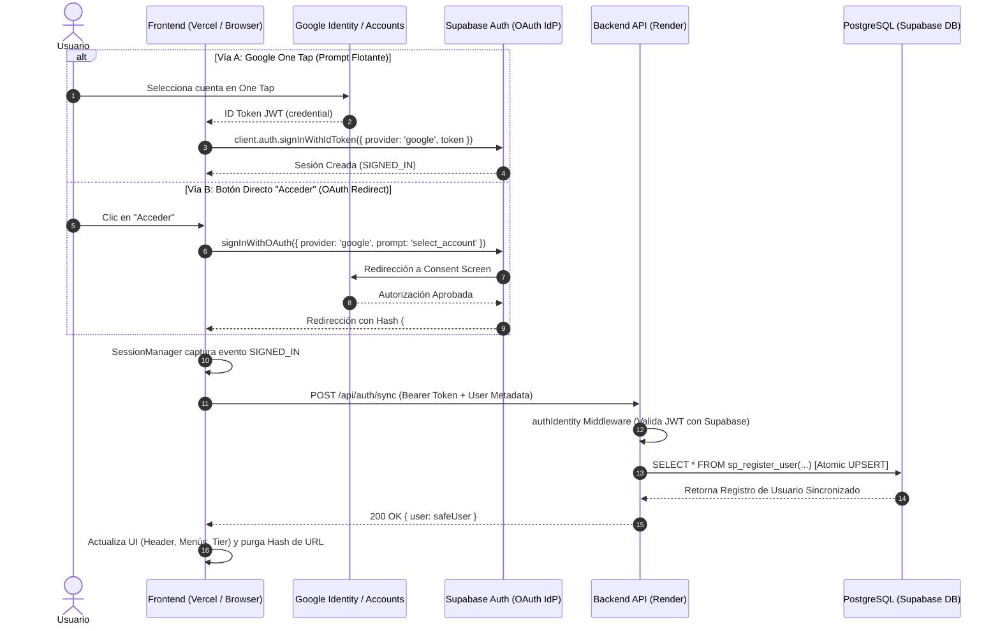
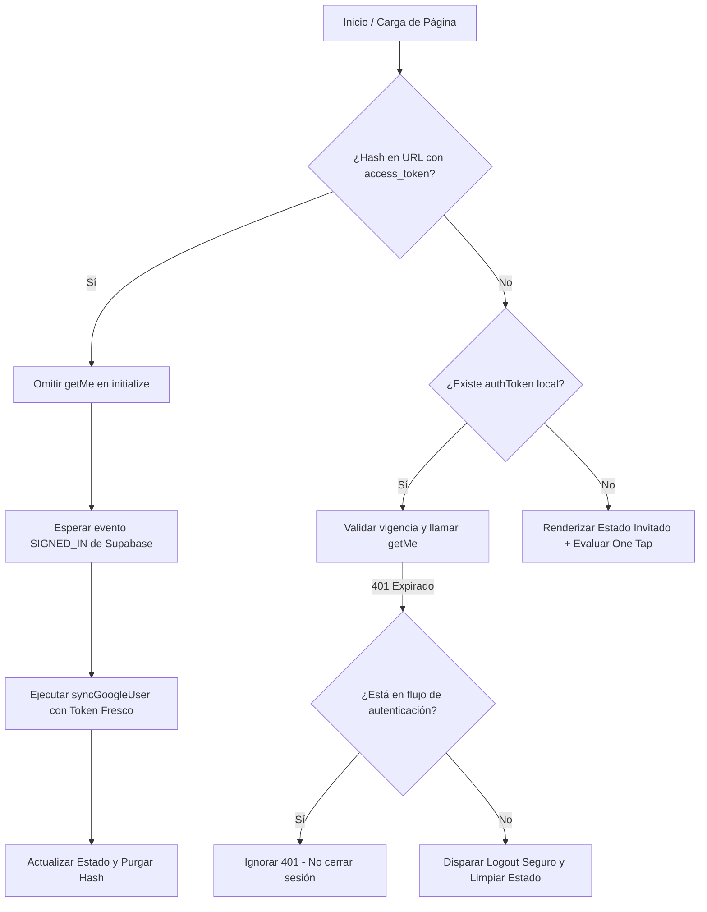

# Arquitectura y Estándares del Sistema de Autenticación (Hub Academia)

Este documento detalla la arquitectura técnica integral, el flujo de vida de la sesión, los mecanismos de seguridad, la persistencia en base de datos y la convivencia de los métodos de acceso implementados en el sistema de autenticación de **Hub Academia**.

---

## 1. Visión General de la Arquitectura

Hub Academia implementa una arquitectura de autenticación **Híbrida Google Identity Services (GIS) + Google OAuth 2.0**, respaldada por **Supabase Auth** como proveedor de identidad (*Identity Provider - IdP*) y **PostgreSQL** como base de datos transaccional del dominio de negocio.

El sistema soporta dos vías de acceso complementarias y coordinadas:
1. **Google One Tap (`signInWithIdToken`):** Diálogo flotante nativo de Google para inicio de sesión instantáneo con un solo clic sin recargar la página.
2. **Google OAuth Direct Flow (`signInWithOAuth`):** Disparado explícitamente desde botones de acción ("Acceder" en el header, modales de protección de contenido y banners interactivos).



---

## 2. Métodos de Acceso y Coexistencia

### 2.1. Google One Tap (`index.html`)
* **Librería:** `https://accounts.google.com/gsi/client` cargada de forma asíncrona.
* **Configuración Programática:**
  ```javascript
  google.accounts.id.initialize({
      client_id: window.AppConfig.GOOGLE_CLIENT_ID,
      callback: handleGlobalOneTap,
      context: "signin",
      ux_mode: "popup",
      auto_select: false,
      use_fedcm_for_prompt: false, // Previene bloqueos experimentales de FedCM en navegadores no-Chrome
      itp_support: true,
      cancel_on_tap_outside: false
  });
  google.accounts.id.prompt();
  ```
* **Filtros de Inicialización (Guards):** One Tap se omite si el usuario ya tiene sesión activa en `localStorage`, si `sessionManager.isLoggedIn()` es verdadero, o si hay un flujo de autenticación/redirección en curso (`_isAuthenticating` o hash en URL).
* **Cancelación Reactiva:** Si el usuario decide iniciar sesión manualmente mediante el botón del header, `SessionManager.onStateChange` ejecuta de inmediato `google.accounts.id.cancel()` para descartar el diálogo flotante sin dejar residuos visuales.

### 2.2. Flujo Directo Google OAuth (`app.js` / `window.triggerGoogleLogin`)
* **Invocación Centralizada:** Accesible globalmente mediante `window.triggerGoogleLogin(buttonElement)`.
* **Configuración:**
  ```javascript
  await client.auth.signInWithOAuth({
      provider: 'google',
      options: { 
          redirectTo: window.location.href, // Retorna al punto exacto donde estaba el usuario
          queryParams: { prompt: 'select_account' } // Permite elegir entre múltiples cuentas de Google
      }
  });
  ```

---

## 3. Componentes y Responsabilidades

### 3.1. Capa Frontend (Presentación)
* **`SessionManager` (`sessionManager.js`)**:
  * **Única Fuente de Verdad:** Controla el estado global de la sesión en el navegador (`currentUser`).
  * **Reactividad:** Implementa el patrón *Observer* (`onStateChange`) para notificar a la cabecera (`updateHeaderUI`), módulos de estudio (`RepasoManager`, `QuizManager`) y paneles administrativos.
  * **Gestión de Retorno OAuth:** Detecta la presencia de `#access_token` o `#id_token` en la URL al cargar la página para delegar la sincronización al evento `SIGNED_IN` y prevenir colisiones con tokens caducados de sesiones previas.
  * **Limpieza Segura (*Nuclear Logout*):** Limpia de forma síncrona `localStorage`, `sessionStorage`, cookies residuales y llama a `supabaseClient.auth.signOut()`.

* **`NetworkService` (`networkService.js`)**:
  * **Gateway Centralizado:** Intercepta todas las peticiones HTTP de la plataforma.
  * **Inyección de Identidad:** Inyecta automáticamente el token Bearer actualizado desde `AuthApiService.getValidToken()`.
  * **Blindaje contra 401 en Autenticación Activa:** No dispara `logout()` ni redirecciones si la plataforma se encuentra en medio de un flujo de login (`_isAuthenticating`, retorno OAuth o `/api/auth/sync`).
  * **Protección en Simulador:** En rutas de exámenes (`quiz.html`, `/simulator`), ante un error 401 no expulsa al usuario a `/`, sino que preserva el estado en memoria y despliega la modal interactiva `auth-prompt-modal`.

* **`AuthApiService` (`authApiService.js`)**:
  * **Capa de Abstracción de Red para Auth:** Encapsula llamadas a `/api/auth/sync`, `/api/auth/me`, `/api/auth/profile` y `/api/auth/delete-account`.
  * **Validación Local de JWT:** Función pura `isTokenExpired(token)` que decodifica el payload en base64 y comprueba `exp` con 60 segundos de margen preventivo sin llamadas de red.

---

### 3.2. Capa Backend (Infraestructura y Dominio)
* **`authMiddleware.js`**:
  * **Validación de Identidad (`authIdentity`):** Diseñado para `/api/auth/sync`. Valida la firma y vigencia del JWT de Supabase sin exigir que el usuario exista previamente en la tabla `users` de PostgreSQL.
  * **Autenticación Completa (`auth`):** Valida el token con Supabase, consulta la base de datos local y monta `req.user` con roles, vidas, tier y límites.
  * **Caché en Memoria de Identidad (`tokenCache`):** Almacena validaciones exitosas de tokens durante 3 minutos para reducir la latencia de red y evitar sobrecargar la API de Supabase.
  * **Resiliencia ante Fallas de Red (`getUserWithRetry`):** Aplica reintentos automáticos con retroceso exponencial (*Exponential Backoff*) ante errores transitorios de conectividad o DNS (`AuthRetryableFetchError`).
  * **Control de Rol Administrador (`adminOnly`):** Restringe el acceso a rutas maestras verificando estrictamente `req.user.role === 'admin'`.

* **`AuthService` (`authService.js`)**:
  * Orquesta la sincronización de Google OAuth y el aprovisionamiento de cuentas.
  * Asignación automática de privilegios administrativos para correos designados (`hubacademia01@gmail.com`).
  * Delegación de la renovación semanal de vidas a `UsageService.renewWeeklyLivesIfNeeded()`.
  * Integración con `supabaseAdmin` singleton para verificar estado de confirmación de correo y borrado de cuentas en Supabase Auth Admin API.

* **`UserRepository` (`userRepository.js`)**:
  * Gestiona la persistencia y lectura de usuarios en PostgreSQL.
  * Invoca el procedimiento almacenado `sp_register_user`.
  * Desvinculación total de cuentas fijas o semillas obsoletas (los administradores y estudiantes son gestionados 100% mediante OAuth de Google).

---

## 4. Persistencia en Base de Datos: `sp_register_user`

Para evitar condiciones de carrera, errores de concurrencia y advertencias de seguridad, el registro y sincronización de usuarios se ejecuta mediante una función atómica en PostgreSQL:

```sql
CREATE OR REPLACE FUNCTION public.sp_register_user(
    p_id UUID,
    p_name TEXT,
    p_email TEXT,
    p_password_hash TEXT,
    p_role TEXT DEFAULT 'student',
    p_avatar_url TEXT DEFAULT NULL
)
RETURNS SETOF public.users AS $$
BEGIN
    -- UPSERT Atómico y Seguro:
    -- 1. Si el correo ya existe, sincroniza el ID de Supabase Auth, avatar y actualiza updated_at.
    -- 2. Si es un usuario nuevo, inserta con tier 'free' y 10 vidas iniciales.
    RETURN QUERY
    INSERT INTO public.users (
        id, name, email, password_hash, role, avatar_url,
        subscription_status, subscription_tier, 
        usage_count, max_free_limit, last_usage_reset, 
        last_free_renewal, created_at, updated_at
    ) 
    VALUES (
        p_id, p_name, lower(p_email), p_password_hash, p_role, p_avatar_url,
        'pending', 'free', 0, 10, CURRENT_DATE, NOW(), NOW(), NOW()
    )
    ON CONFLICT (email) 
    DO UPDATE SET
        id = EXCLUDED.id,
        name = EXCLUDED.name,
        avatar_url = COALESCE(EXCLUDED.avatar_url, public.users.avatar_url),
        updated_at = NOW()
    RETURNING *;
END;
$$ LANGUAGE plpgsql SECURITY DEFINER SET search_path = public;

-- Revocación de privilegios públicos (Solo backend con credenciales de base de datos)
REVOKE EXECUTE ON FUNCTION public.sp_register_user(uuid, text, text, text, text, text) FROM PUBLIC, anon, authenticated;
```

### Garantías de este diseño:
1. **Unicidad y Resiliencia (`23505 Immunity`):** Al usar `ON CONFLICT (email) DO UPDATE`, jamás se generan excepciones por llave duplicada en los registros del servidor PostgreSQL.
2. **Seguridad de `search_path`:** La directiva explícita `SET search_path = public` mitiga vulnerabilidades de inyección por suplantación de esquemas (cumpliendo con el linter de seguridad de Supabase).
3. **Control de Acceso:** Ejecución restringida (`REVOKE EXECUTE FROM anon, authenticated`).

---

## 5. Estándares de Rendimiento y Latencia

| Operación | Mecanismo | Latencia Típica |
| :--- | :--- | :---: |
| Validación de Expiración JWT | Local en cliente / backend (`jwt.decode`) | **< 1 ms** |
| Verificación en Caché de Servidor | `tokenCache.get(token)` | **< 2 ms** |
| Sincronización DB (`sp_register_user`) | PostgreSQL UPSERT en Pooler Transaccional | **~100 - 200 ms** |
| Consulta de Usuario (`findById`) | Índice PK sobre tabla `users` | **~50 - 100 ms** |
| **Tiempo Total de Login Activo** | Flujo completo Frontend ↔ Backend ↔ DB | **< 400 ms** |

---

## 6. Prevención de Condiciones de Carrera (Race Conditions)



1. **Retorno OAuth sin Falso 401:** Al regresar de Google, `initialize()` no compite llamando a `/api/auth/me` con tokens caducados de sesiones previas.
2. **Bloqueo Concurrente en Sincronización:** Las banderas `window._isGlobalSyncing` e `isSyncing` evitan peticiones simultáneas si Supabase dispara eventos duplicados.
3. **Throttling en Cliente:** Ventana de enfriamiento de 3000 ms (`throttleWindow`) para filtrar eventos repetidos en ráfaga.

---

## 7. Configuración de Entornos y Rate Limiting

### Backend (`server.js` / `rateLimiters.js`)
* **`trust proxy = 1`:** Habilitado para interpretar correctamente las cabeceras `X-Forwarded-For` detrás del proxy inverso de Render y Vercel.
* **`authLimiter`:** Protege `/api/auth/sync` permitiendo hasta 100 solicitudes por IP cada 15 minutos, con exclusión automática (`skip`) para `localhost`, `127.0.0.1` y `::1`.
* **Pooler de PostgreSQL:** Conexión mediante `aws-1-us-east-1.pooler.supabase.com:6543` (Modo Transacción) con SSL seguro.

---

## 8. Mantenimiento y Buenas Prácticas

1. **Nunca almacenar contraseñas en texto plano ni crear usuarios fantasma:** Los usuarios se crean y autentican exclusivamente mediante el proveedor de identidad de Google (One Tap / OAuth).
2. **Nombres y Metadatos Seguros:** Toda información proveniente del proveedor OAuth es saneada y acotada (`slice(0, 120)`) antes de persistirse.
3. **Preservación del Historial de Pruebas:** Toda modificación al flujo de autenticación debe estar acompañada de la ejecución de la suite de pruebas unitarias:
   ```bash
   npm test -- tests/unit/authService.test.js tests/unit/authIdentityMiddleware.test.js tests/unit/authClientFlow.test.js
   ```

---
*Documentación técnica de arquitectura - Hub Academia.*  
*Última actualización: 2026-08-28.*
