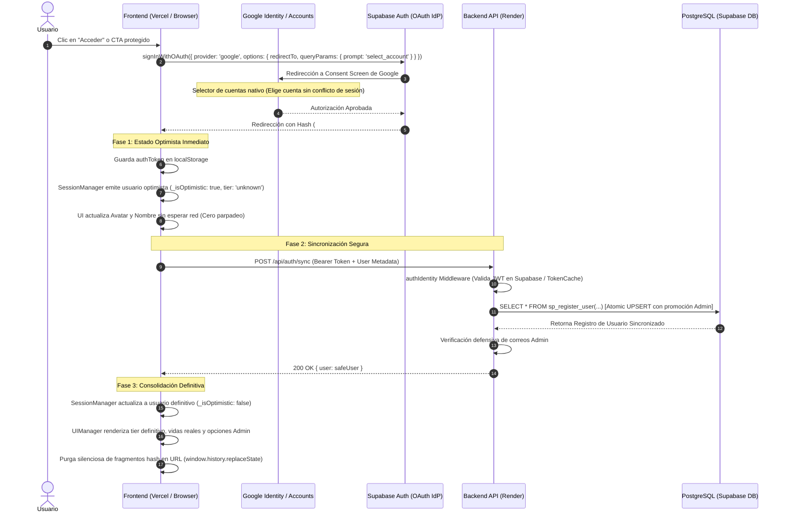
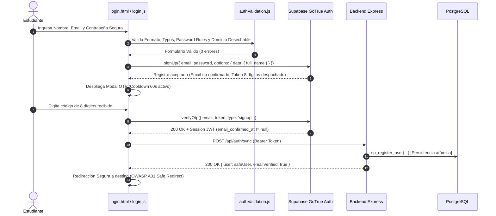
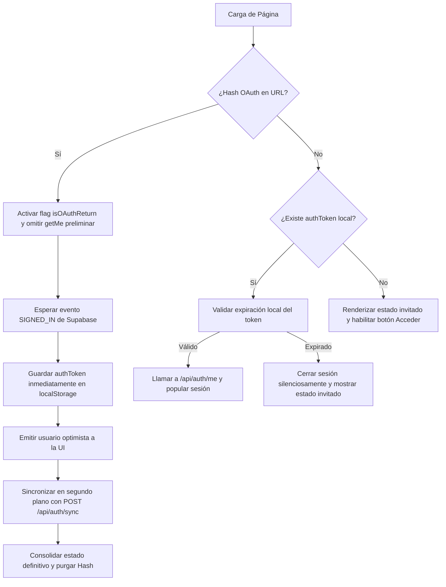

# Arquitectura y Estándares del Sistema de Autenticación (Hub Academia)

Este documento detalla la arquitectura técnica integral, el flujo de vida de la sesión, los mecanismos de seguridad, la persistencia en base de datos, el renderizado optimista y la convivencia de los métodos de acceso implementados en el sistema de autenticación de **Hub Academia** y sus aplicaciones ecosistémicas (**HubDocenteApp** y **HubSaludApp**).

---

## 1. Visión General de la Arquitectura

Hub Academia implementa una arquitectura de autenticación estandarizada basada en **Google OAuth 2.0 Direct Flow** con selector explícito de cuentas (`prompt: 'select_account'`), respaldada por **Supabase Auth** como proveedor de identidad (*Identity Provider - IdP*) y **PostgreSQL** como base de datos transaccional del dominio de negocio.

Toda la plataforma web y los entornos educativos utilizan un flujo de autenticación unificado, robusto y multiplataforma:
* **Google OAuth Direct Flow (`signInWithOAuth`):** Disparado explícitamente desde botones de acción ("Acceder" en el header, modales de protección de contenido y banners interactivos).


```mermaid
sequenceDiagram
    autonumber
    actor Usuario
    participant Frontend as Frontend (Vercel / Browser)
    participant Google as Google Identity / Accounts
    participant Supabase as Supabase Auth (OAuth IdP)
    participant Backend as Backend API (Render)
    participant Postgres as PostgreSQL (Supabase DB)

    Usuario->>Frontend: Clic en "Acceder" o CTA protegido
    Frontend->>Supabase: signInWithOAuth({ provider: 'google', options: { redirectTo, queryParams: { prompt: 'select_account' } } })
    Supabase->>Google: Redirección a Consent Screen de Google
    Note over Google: Selector de cuentas nativo (Elige cuenta sin conflicto de sesión)
    Google-->>Supabase: Autorización Aprobada
    Supabase-->>Frontend: Redirección con Hash (#access_token=...&refresh_token=...)

    Note over Frontend: Fase 1: Estado Optimista Inmediato
    Frontend->>Frontend: Guarda authToken en localStorage
    Frontend->>Frontend: SessionManager emite usuario optimista (_isOptimistic: true, tier: 'unknown')
    Frontend->>Frontend: UI actualiza Avatar y Nombre sin esperar red (Cero parpadeo)

    Note over Frontend,Backend: Fase 2: Sincronización Segura
    Frontend->>Backend: POST /api/auth/sync (Bearer Token + User Metadata)
    Backend->>Backend: authIdentity Middleware (Valida JWT en Supabase / TokenCache)
    Backend->>Postgres: SELECT * FROM sp_register_user(...) [Atomic UPSERT con promoción Admin]
    Postgres-->>Backend: Retorna Registro de Usuario Sincronizado
    Backend->>Backend: Verificación defensiva de correos Admin
    Backend-->>Frontend: 200 OK { user: safeUser }

    Note over Frontend: Fase 3: Consolidación Definitiva
    Frontend->>Frontend: SessionManager actualiza a usuario definitivo (_isOptimistic: false)
    Frontend->>Frontend: UIManager renderiza tier definitivo, vidas reales y opciones Admin
    Frontend->>Frontend: Purga silenciosa de fragmentos hash en URL (window.history.replaceState)
```

---

## 2. Métodos de Acceso: Flujo Directo y Google One Tap Resiliente (FedCM)

### 2.1. Diagnóstico Técnico de FedCM y Resolución de Error 400 (`invalid_user`)
En versiones modernas de Chromium (Google Chrome 120 a 145+), Google forzó la API **FedCM (Federated Credential Management)** en modo pasivo (`mode=passive`) para los flujos de Google One Tap.

**Causa Raíz de los Fallos Anteriores en Google Chrome:**
1. **Conflicto Multi-Cuenta (`Error 400: invalid_user`):** Chrome mantiene un registro interno de identidades (`login_hint`). Si el usuario tiene múltiples cuentas de Google abiertas o su cookie de sesión cambió de índice, la API FedCM emite:
   > `FedCM request failed to identify a unique session`
2. **Ventanas Emergentes Bloqueantes por `itp_support: true`:** La implementación anterior utilizaba `itp_support: true` o intentaba forzar `ux_mode: 'popup'`. Ante la falla de aserción pasiva, la librería externa de Google intentaba recuperarse abriendo automáticamente un popup a `accounts.google.com/signin/oauth/error`, mostrando la pantalla negra de *"Acceso bloqueado: error de autorización (Error 400: invalid_user)"*, interrumpiendo la navegación.

**Solución Arquitectónica: `GoogleOneTapService` (`googleOneTapService.js`):**
Para restituir el acceso rápido sin riesgos de error o bloqueo, se diseñó un servicio modular, aislado y testeado con cobertura unitaria completa:
* **Configuración Blindada:** Se elimina estrictamente `itp_support: true` y no se fuerza `ux_mode: 'popup'` en `initialize()`. La inicialización utiliza configuración mínima y limpia:
  ```javascript
  google.accounts.id.initialize({
      client_id: clientId,
      callback: (res) => this.handleCredential(res),
      auto_select: false,
      cancel_on_tap_outside: true,
      context: 'signin'
  });
  ```
* **Degradación Silenciosa con `momentListener`:** El prompt se invoca capturando el estado de la notificación:
  ```javascript
  google.accounts.id.prompt((notification) => {
      if (notification.isNotDisplayed()) {
          console.log('ℹ️ [GoogleOneTapService] Prompt no mostrado:', notification.getNotDisplayedReason?.());
      } else if (notification.isSkippedMoment()) {
          console.log('ℹ️ [GoogleOneTapService] Prompt omitido:', notification.getSkippedReason?.());
      } else if (notification.isDismissedMoment()) {
          console.log('ℹ️ [GoogleOneTapService] Prompt cerrado por el usuario.');
      }
  });
  ```
  Si FedCM no puede resolver la identidad unívoca de forma pasiva, **degrada en completo silencio**, sin lanzar excepciones ni abrir popups molestos.
* **Condiciones de Guarda (`canPrompt()`):** Se evalúa preventivamente:
  * Si el usuario ya cuenta con sesión activa (`localStorage.getItem('authToken')` o `sessionManager.isLoggedIn()`), el prompt no se muestra.
  * Si existe una navegación OAuth en curso (`_isAuthenticating` o fragmentos hash `#access_token=...`), se omite.
* **Integración Nativa con Supabase (`handleCredential`):**
  Al recibir el ID Token (JWT) desde One Tap, se envía directamente a Supabase:
  ```javascript
  const { data, error } = await client.auth.signInWithIdToken({
      provider: 'google',
      token: response.credential
  });
  ```
  Esto dispara de inmediato el evento `SIGNED_IN` en `SessionManager`, activando el pipeline habitual de renderizado optimista, sincronización con backend y consolidación en PostgreSQL.
* **Cancelación Reactiva (`cancel()`):** Si el usuario inicia sesión mediante cualquier otro botón o CTA, el observer de `SessionManager` invoca automáticamente `GoogleOneTapService.cancel()`.

### 2.2. Flujo Directo Google OAuth (`app.js` / `window.triggerGoogleLogin`)
Es el canal explícito principal, activado manualmente por el usuario ("Acceder" en el header, modales de protección de contenido y botones de simulacros).
* **Invocación Centralizada:** Accesible globalmente mediante `window.triggerGoogleLogin(buttonElement)`.
* **Cumplimiento RFC 6749 (Sin fragmentos hash en Redirect URI):**
  ```javascript
  const cleanRedirectUrl = window.location.origin + window.location.pathname;
  const { data, error } = await client.auth.signInWithOAuth({
      provider: 'google',
      options: { 
          redirectTo: cleanRedirectUrl,
          queryParams: { prompt: 'select_account' } // Permite elegir entre múltiples cuentas sin ambigüedad
      }
  });
  if (data?.url) {
      window.location.href = data.url; // Navegación explícita y segura
  }
  ```
* **Retorno OAuth sin Falso 401:** Al retornar de Google con fragmento hash (`#access_token=...`), `SessionManager.initialize()` detecta `isOAuthReturn` y omite llamadas preliminares con tokens viejos, esperando a que Supabase emita `SIGNED_IN`.

### 2.3. Estado y Compatibilidad en Aplicaciones Móviles (HubDocenteApp y HubSaludApp)
* **Aislamiento de Entorno:** Las aplicaciones móviles del ecosistema están construidas en React Native (Expo) y gestionan la autenticación mediante el módulo nativo `WebBrowser.openAuthSessionAsync` acoplado a deep linking (`Linking.createURL`).
* **Inmunidad a FedCM:** La biblioteca DOM `accounts.google.com/gsi/client` y el protocolo FedCM son APIs del navegador web. Las aplicaciones móviles se conectan directamente vía browser modal nativo del sistema operativo (Custom Tabs en Android / ASWebAuthenticationSession en iOS), por lo que **no requieren modificaciones ni están expuestas a los conflictos de FedCM/One Tap del navegador web**.
* **Seguridad de Deep Linking (OWASP Mobile M9):**
  * Toda URL entrante por deep linking debe ser validada contra el esquema oficial permitido (`hubacademia://`, `hubdocente://`, `hubsalud://`) mediante funciones de guarda que descarten esquemas maliciosos o peligrosos (`javascript:`, `data:`, `file:`, `intent:`).
  * Los tokens recibidos en callbacks móviles deben ser consumidos de inmediato y nunca persistidos en la URL ni compartidos entre componentes no autenticados.
* **Almacenamiento Criptográfico Seguro (OWASP Mobile M1):**
  * En clientes móviles, los tokens de acceso y sesión deben almacenarse de forma mandatoria en `ExpoSecureStore`, respaldado por el Hardware Keystore en Android y el Keychain en iOS, prohibiendo estrictamente el uso de `AsyncStorage` en texto plano para material criptográfico o credenciales.

### 2.4. Flujo Híbrido: Email / Password con Código OTP de 8 Dígitos y Estándar MeduCat

Para usuarios que no utilizan cuentas de Google o acceden desde navegadores institucionales restrictivos, Hub Academia implementa un flujo dual con verificación estricta de correo electrónico respaldado por Supabase GoTrue ("Confirm email" activo en el dashboard):

#### Anatomía del Código OTP de 8 Dígitos
* Supabase Auth envía un código numérico de 8 dígitos (`{{ .Token }}`).
* La interfaz implementa un modal embebido interactivo de 8 casillas (`VerifyEmailOtpModal`) con soporte para copiado/pegado automático, teclado numérico nativo en dispositivos móviles (`inputmode="numeric"`) y navegación automática de foco.


```mermaid
sequenceDiagram
    autonumber
    actor Estudiante
    participant UI as login.html / login.js
    participant Val as authValidation.js
    participant Supabase as Supabase GoTrue Auth
    participant Backend as Backend Express
    participant DB as PostgreSQL

    Estudiante->>UI: Ingresa Nombre, Email y Contraseña Segura
    UI->>Val: Valida Formato, Typos, Password Rules y Dominio Desechable
    Val-->>UI: Formulario Válido (0 errores)
    UI->>Supabase: signUp({ email, password, options: { data: { full_name } } })
    Supabase-->>UI: Registro aceptado (Email no confirmado, Token 8 dígitos despachado)
    UI->>UI: Despliega Modal OTP (Cooldown 60s activo)
    Estudiante->>UI: Digita código de 8 dígitos recibido
    UI->>Supabase: verifyOtp({ email, token, type: 'signup' })
    Supabase-->>UI: 200 OK + Session JWT (email_confirmed_at != null)
    UI->>Backend: POST /api/auth/sync (Bearer Token)
    Backend->>DB: sp_register_user(...) [Persistencia atómica]
    Backend-->>UI: 200 OK { user: safeUser, emailVerified: true }
    UI->>UI: Redirección Segura a destino (OWASP A01 Safe Redirect)
```

#### Resolución Sin Fricción de los 3 Escenarios MeduCat:
1. **Escenario A (Registro Fresco & Temporizador 60s):**
   - Al registrarse, se activa una cuenta regresiva visible: *"Reenviar nuevo código en 60s..."*.
   - Al llegar a `00:00`, el texto muta reactivamente al botón interactivo: *"¿No recibiste el código? Reenviar"*.
   - El reenvío invoca `supabase.auth.resend({ type: 'signup', email })`, rearmando el temporizador a 60s para prevenir saturación de la bandeja del usuario o abusos de cuota SMTP.
2. **Escenario B (Inicio de Sesión Diferido con Cuenta Pendiente):**
   - Si el estudiante cerró la pestaña y vuelve días después para entrar por *"Iniciar Sesión"*, Supabase responde con el error `Email not confirmed` (`email_not_confirmed`).
   - El sistema intercepta el error, suprime alertas genéricas y despliega inmediatamente el modal de verificación OTP pre-cargado con su correo, ofreciendo el reenvío de un código fresco.
3. **Escenario C (Intento de Registro Duplicado):**
   - Si el usuario olvida que ya tenía cuenta e intenta registrarse nuevamente, Supabase devuelve `User already registered` o `A user with this email address has already been registered`.
   - El sistema detecta la colisión, muestra una alerta informativa amigable (*"Esta cuenta ya existe. Por favor ingresa tu contraseña para iniciar sesión"*) y conmuta automáticamente a la pestaña de *"Iniciar Sesión"*, preservando el correo ingresado y situando el cursor en el campo de contraseña.

#### Controles Anti-Abuso y Protección de Checkout:
1. **Filtro de Dominios Desechables (`isDisposableEmail`):** Lista negra de dominios temporales (*10minutemail, tempmail, guerrillamail, yopmail, mailinator, etc.*) bloqueando registros ficticios masivos.
2. **Checklist de Seguridad en Tiempo Real:** Exige mínimo 8 caracteres, al menos 1 mayúscula, 1 minúscula, 1 número, sin espacios en blanco y sin caracteres de control.
3. **Sugerencias de Dominios por Typos (`suggestEmailDomain`):** Detecta errores frecuentes como `@gmil.com` -> `@gmail.com`, `@hotmial.com` -> `@hotmail.com`, evitando que el usuario pierda su código de activación por un error de digitación.
4. **Protección de Pasarela de Pagos (`pricing.js`):** Antes de iniciar la orden con Mercado Pago, el sistema valida `currentUser.emailVerified !== false`. Si la cuenta no está verificada, bloquea el pago y muestra el aviso de confirmación requerida con enlace directo a `/login?redirect=pricing`.

### 2.5. Gating Progresivo, Protección de Recursos y Experiencia de Usuario (Fase 2)

Para neutralizar el vector de ataque de "creación masiva de cuentas ficticias" sin sacrificar la ergonomía del usuario legítimo, Hub Academia implementa un sistema de acceso escalonado (*Tiered / Progressive Access Gateway*) tanto en backend como en frontend:

#### 1. Protección de Endpoints de Alto Costo (`checkLimitsMiddleware.js`)
El middleware interceptor inspecciona defensivamente la propiedad `req.user.emailVerified` adjunta por `authMiddleware`. Si un usuario autenticado no ha confirmado su correo electrónico (`req.user.emailVerified === false`) y no ostenta privilegios de administrador, se deniega inmediatamente el consumo de recursos sensibles:
* **Simulacros de Examen (`simulator`):** `/api/medico/start` y `/api/docente/start` retornan `403 Forbidden` con payload `{ error: 'Debes confirmar tu correo electrónico con el código de 8 dígitos para iniciar simulacros de examen.', reason: 'EMAIL_VERIFICATION_REQUIRED', emailVerified: false }`.
* **Tutorías Pedagógicas y Flashcard Tutor (`chat_standard` con contexto):** Consultas al Tutor IA retornan `403 Forbidden` (`EMAIL_VERIFICATION_REQUIRED`).
* **Diagnósticos Clínicos y Académicos (`isDiagnostic`):** Generación de informes dinámicos con Gemini (`/api/analytics/diagnostic`) retorna `403 Forbidden` (`EMAIL_VERIFICATION_REQUIRED`).
* **Flashcards y Módulos de Repaso (`monthly_flashcards`):** Creación, importación masiva y generaciones con IA en `/api/decks` retornan `403 Forbidden` (`EMAIL_VERIFICATION_REQUIRED`).
* **Chat Guía Efímero:** El asistente de soporte general en `/api/chat` (sin RAG ni persistencia) se mantiene habilitado con `cost = 0` y `usageType = null`, permitiendo a los estudiantes solicitar orientación para verificar su cuenta.

#### 2. Bloqueo de Vidas Gratuitas (0 Vidas Activas hasta Confirmar)
* En cuentas pendientes de confirmación, `hasGlobalLives` evalúa estrictamente a `false`.
* El usuario visualiza `0/10 vidas disponibles (bloqueadas)` tanto en la barra Freemium (`uiManager.js`) como en la sección de consumo del perfil (`profile.js`), desincentivando el registro automatizado de cuentas falsas para agotar vidas.

#### 3. Experiencia Visual y Verificación In-Situ en Perfil (`profile.html` / `profile.js`)
* **Banner de Advertencia Superior:** Si `user.emailVerified === false`, se inyecta un banner contextual ámbar (`.unverified-alert-banner`) en la parte superior del perfil alertando la restricción de vidas y ofreciendo el botón `"Confirmar con Código OTP"`.
* **Badge Interactivo en Cabecera:** Muestra la insignia interactiva `badge-status-unverified` (*"Correo No Verificado • Verificar"*), que abre directamente el modal de verificación.
* **Tarjeta de Seguridad y Cuenta:** El indicador "Estado de Identidad" muta reactivamente a `Pendiente de Verificación` (amarillo) o `Activa y Verificada` (verde esmeralda).
* **Modal de Verificación Embebido (`#otp-modal`):** Permite ingresar el código de 8 dígitos recibido por correo, verificarlo directamente con `supabaseClient.auth.verifyOtp` y resincronizar la sesión en tiempo real (`updateEmailVerificationUI(true)`) sin requerir recargar la página.

#### 4. Barra Freemium Reactiva (`uiManager.js`)
* Si `user.emailVerified === false`, el contador de vidas refleja `0/10`, el pill activa la alerta visual `.low-lives` y el botón de acción principal conmuta automáticamente a `"✉️ Verificar Correo"`, vinculando directamente a `/profile`.

#### 5. Paridad Multiplataforma Completa en Aplicaciones Móviles
* **Ecosistema Móvil:** Implementado al 100% en **HubDocenteApp** y **HubSaludApp** con paridad respecto a **MeduCat**:
  - `VerifyEmailOtpModal.tsx`: Modal nativo con 8 casillas interactivas, auto-enfoque, teclado numérico y temporizador de 60s con reenvío.
  - `authValidation.ts`: Funciones de filtrado de dominios desechables, sugerencias tipográficas (`suggestEmailDomain`), validación de nombres, contraseñas y códigos OTP.
  - `AuthContext.tsx`: Métodos `signInWithEmail`, `signUpWithEmail`, `verifyEmailOtp`, `resendVerificationOtp`, `resetPassword`, cálculo de `isEmailVerified` y congelamiento de vidas a `0/10` para cuentas no confirmadas.
  - `login.tsx`: Conmutador de pestañas (Iniciar Sesión / Crear Cuenta), botón de Google con selector de cuentas, checklist en vivo de contraseñas y resolución sin fricción de los 3 escenarios MeduCat (A, B y C).
  - `profile.tsx`: Banner de alerta de correo no confirmado, status badge `NO VERIFICADO`, tarjeta de vidas bloqueadas con candado y botón de activación in-situ.
  - `pricing.tsx`: Banner superior y bloqueo preventivo de pagos (Mercado Pago / Yape) si el usuario no ha verificado su cuenta.
  - **Verificación de Tipado:** 0 errores de TypeScript (`tsc --noEmit`) en ambas aplicaciones.


---

## 3. Componentes y Responsabilidades

### 3.1. Capa Frontend (Presentación)

#### `SessionManager` (`sessionManager.js`)
* **Única Fuente de Verdad:** Controla el estado global de la sesión en el navegador (`currentUser`).
* **Patrón Observer con Invocación Inmediata:**
  ```javascript
  onStateChange(callback) {
      if (typeof callback === 'function') {
          this.listeners.push(callback);
          // Si ya existe un usuario en memoria, se ejecuta de inmediato para evitar
          // condiciones de carrera por orden de carga asíncrona de scripts
          if (this.currentUser) {
              try {
                  callback(this.currentUser);
              } catch (e) {
                  console.error('Error en listener inmediato de sesión:', e);
              }
          }
      }
  }
  ```
* **Renderizado Optimista:**
  * Al capturar `SIGNED_IN` o `INITIAL_SESSION`, guarda inmediatamente el token fresco en `localStorage.setItem('authToken', session.access_token)`.
  * Emite un usuario provisional con `_isOptimistic: true`, `subscriptionTier: 'unknown'` y `subscriptionStatus: 'pending'`.
  * Si el correo pertenece a la lista de administradores, asigna preventivamente `role: 'admin'`.
  * Esto permite que la interfaz muestre el nombre y avatar del usuario al instante (< 10 ms), sin pantallas en blanco ni bloqueos de interfaz.
* **Consolidación Definitiva:**
  * Ejecuta en segundo plano `syncGoogleUser` con el backend.
  * Al recibir la respuesta de `/api/auth/sync`, consolida los datos reales (`tier`, `vidas`, `role`) y emite una segunda actualización con `_isOptimistic: false`.
* **Saneamiento de URL:**
  * Al completarse la sesión, purga el hash de la barra de direcciones mediante `window.history.replaceState(null, '', cleanUrl)`.
* **Limpieza Segura (*Nuclear Logout*):**
  * Limpia de forma síncrona `localStorage`, `sessionStorage`, cachés locales y ejecuta `supabaseClient.auth.signOut()`.

#### `UIManager` (`uiManager.js`)
* **Supresión de Parpadeo en Barra de Vidas:**
  ```javascript
  updateFreemiumStatus(user) {
      // Evita renderizar la barra de vidas si el usuario aún está en estado optimista
      // impidiendo que los usuarios Basic/Advanced vean la barra por una fracción de segundo
      if (!user || user._isOptimistic || user.subscriptionTier === 'unknown') {
          return;
      }
      // Renderizado de vidas solo para usuarios confirmados de tier 'free'
      ...
  }
  ```
* **Supresión de Modal de Renovación Semanal:**
  * `checkAndShowWelcomeModal()` bloquea el modal de "10 vidas semanales" si:
    1. El usuario está en estado optimista (`_isOptimistic`).
    2. El usuario pertenece a un plan de pago (`basic` o `advanced`).
    3. La página actual es un entorno de evaluación (`quiz.html` o `simulator-dashboard.html`).
* **Soporte de Rol Administrador en Header:**
  * Si `user.role === 'admin'`, se inyecta dinámicamente la opción **"Panel de Gestión"** (`/admin.html`) en el menú desplegable del usuario.
  * El distintivo del plan muestra la etiqueta dorada **"Administrador"** con clase `.tier-admin` (`#f59e0b`).

#### `NetworkService` (`networkService.js`) y `AuthApiService` (`authApiService.js`)
* **Gateway Centralizado:** Inyecta automáticamente el token Bearer actualizado desde `AuthApiService.getValidToken()`.
* **Protección contra 401 en Tránsito:** Si la aplicación se encuentra en medio de un flujo de login (`_isAuthenticating` o retorno OAuth), los errores 401 no disparan `logout()` prematuro ni redirecciones involuntarias.
* **Validación Local de JWT:** `isTokenExpired(token)` decodifica el payload en base64 y evalúa `exp` con 60 segundos de holgura preventiva sin consumo de red.

---

### 3.2. Capa Backend (Infraestructura y Dominio)

#### `authMiddleware.js`
* **`authIdentity`:** Diseñado exclusivamente para `/api/auth/sync`. Valida la firma y vigencia del JWT con Supabase sin exigir la existencia previa del usuario en la tabla `users` de PostgreSQL.
* **`auth`:** Autenticación completa para rutas protegidas. Valida el token con Supabase, consulta la base de datos local y construye `req.user` con roles, vidas, tier y límites.
* **Caché en Memoria (`tokenCache`):** Almacena en memoria las validaciones exitosas de tokens durante 3 minutos (con limpieza automática por TTL) para reducir drásticamente la latencia y evitar la saturación de la API de Supabase.
* **Resiliencia de Red (`getUserWithRetry`):** Aplica reintentos automáticos con retroceso exponencial (*Exponential Backoff*) ante errores transitorios de red o DNS (`AuthRetryableFetchError`).
* **`adminOnly`:** Restringe el acceso a endpoints de gestión validando estrictamente `req.user.role === 'admin'`.

#### `AuthService` (`authService.js`)
* **Orquestación de Sincronización:** Recibe los metadatos de Google (`id`, `name`, `email`, `avatar_url`) y delega el registro al repositorio.
* **Promoción Defensiva de Administradores:**
  Tanto en `syncGoogleUser` como en `getUserWithStatus`, el servicio contrasta el correo contra la lista blanca configurada (`ADMIN_EMAILS`):
  ```javascript
  const adminEmails = (process.env.ADMIN_EMAILS || 'hubacademia01@gmail.com')
      .split(',')
      .map(e => e.trim().toLowerCase());
  
  if (adminEmails.includes(user.email.toLowerCase()) && user.role !== 'admin') {
      await this.userRepository.update(user.id, { role: 'admin' });
      user.role = 'admin';
  }
  ```
* **Renovación Semanal de Vidas:** Delega a `UsageService.renewWeeklyLivesIfNeeded()` el restablecimiento de vidas para usuarios del plan `free`.

#### `UserRepository` (`userRepository.js`)
* Invoca la función almacenada `sp_register_user`.
* Incluye mecanismo de respaldo (*fallback*) directo con cláusula `ON CONFLICT (email) DO UPDATE SET role = CASE WHEN EXCLUDED.role = 'admin' THEN 'admin' ELSE users.role END`.

---

## 4. Persistencia en Base de Datos: `sp_register_user`

El registro y sincronización de usuarios se ejecuta mediante una función atómica en PostgreSQL (`src/infrastructure/database/sp_register_user.sql`):

```sql
CREATE OR REPLACE FUNCTION sp_register_user(
    p_id UUID,
    p_name TEXT,
    p_email TEXT,
    p_password_hash TEXT,
    p_role TEXT DEFAULT 'student',
    p_avatar_url TEXT DEFAULT NULL
)
RETURNS SETOF public.users AS $$
BEGIN
    -- UPSERT Atómico y Seguro:
    -- 1. Si el correo ya existe, sincroniza el ID de Supabase Auth, avatar, actualiza timestamp
    --    y promueve el rol a 'admin' si el nuevo rol es 'admin' sin degradar admins existentes.
    -- 2. Si es un usuario nuevo, inserta con tier 'free' y 10 vidas iniciales.
    RETURN QUERY
    INSERT INTO public.users (
        id, name, email, password_hash, role, avatar_url,
        subscription_status, subscription_tier, 
        usage_count, max_free_limit, last_usage_reset, 
        last_free_renewal, created_at, updated_at
    ) 
    VALUES (
        p_id, p_name, lower(p_email), p_password_hash, p_role, p_avatar_url,
        'pending', 'free', 0, 10, CURRENT_DATE, NOW(), NOW(), NOW()
    )
    ON CONFLICT (email) 
    DO UPDATE SET
        id = EXCLUDED.id, -- Sincronizar el ID de Supabase Auth
        name = COALESCE(NULLIF(TRIM(public.users.name), ''), EXCLUDED.name), -- Preservar nombre personalizado
        role = CASE 
            WHEN EXCLUDED.role = 'admin' THEN 'admin'
            ELSE public.users.role
        END,
        avatar_url = COALESCE(EXCLUDED.avatar_url, public.users.avatar_url),
        updated_at = NOW()
    RETURNING *;
END;
$$ LANGUAGE plpgsql SECURITY DEFINER SET search_path = public, pg_temp;

-- Revocación de privilegios públicos (Solo backend con credenciales seguras de servicio)
REVOKE EXECUTE ON FUNCTION public.sp_register_user(uuid, text, text, text, text, text) FROM PUBLIC, anon, authenticated;
```

### Garantías de este diseño:
1. **Inmunidad a Colisiones (`23505 Immunity`):** `ON CONFLICT (email) DO UPDATE` garantiza cero errores de concurrencia al registrar usuarios simultáneos.
2. **Preservación y Elevación de Privilegios:** La cláusula condicional `CASE WHEN EXCLUDED.role = 'admin' THEN 'admin' ELSE public.users.role END` asegura que una cuenta designada como administradora nunca quede degradada a `student` tras un re-login, elevando automáticamente su privilegio en base de datos.
3. **Seguridad de Esquema contra Trojan Object Hijack (`search_path = public, pg_temp`):** La directiva explícita `SET search_path = public, pg_temp;` fija el orden de resolución de tablas y operadores, neutralizando ataques donde un actor malicioso define funciones u operadores homónimos en esquemas temporales (`pg_temp`) para secuestrar el contexto privilegiado de una función `SECURITY DEFINER`.
4. **Acceso Restringido:** Ejecución revocada para roles anónimos y autenticados (`REVOKE EXECUTE FROM anon, authenticated`). Solo el pool de conexiones del backend con `service_role` puede invocarla.

---

## 5. Estándares de Rendimiento y Latencia

| Operación | Mecanismo | Latencia Típica |
| :--- | :--- | :---: |
| Emisión de Estado Optimista | Local en memoria (`SessionManager`) | **< 5 ms** |
| Persistencia Anticipada de Token | Síncrona en `localStorage` | **< 1 ms** |
| Validación de Expiración JWT | Local en cliente (`isTokenExpired`) | **< 1 ms** |
| Verificación en Caché de Backend | `tokenCache.get(token)` | **< 2 ms** |
| Sincronización DB (`sp_register_user`) | PostgreSQL UPSERT en Pooler Transaccional | **~80 - 150 ms** |
| Consulta de Usuario (`findById`) | Búsqueda por PK indexada | **~30 - 60 ms** |
| **Tiempo Total a UI Interactiva** | Renderizado Optimista Inicial | **< 20 ms** |
| **Tiempo de Consolidación Final** | Flujo completo Frontend ↔ Backend ↔ DB | **~250 - 350 ms** |

---

## 6. Prevención de Condiciones de Carrera (Race Conditions)


```mermaid
graph TD
    A[Carga de Página] --> B{¿Hash OAuth en URL?}
    B -- Sí --> C[Activar flag isOAuthReturn y omitir getMe preliminar]
    C --> D[Esperar evento SIGNED_IN de Supabase]
    D --> E[Guardar authToken inmediatamente en localStorage]
    E --> F[Emitir usuario optimista a la UI]
    F --> G[Sincronizar en segundo plano con POST /api/auth/sync]
    G --> H[Consolidar estado definitivo y purgar Hash]

    B -- No --> I{¿Existe authToken local?}
    I -- Sí --> J[Validar expiración local del token]
    J -- Válido --> K[Llamar a /api/auth/me y popular sesión]
    J -- Expirado --> L[Cerrar sesión silenciosamente y mostrar estado invitado]
    I -- No --> M[Renderizar estado invitado y habilitar botón Acceder]
```

1. **Invocación Inmediata de Observadores:** Al invocar `sessionManager.onStateChange(cb)`, si el usuario ya está cargado en memoria, el callback se dispara en ese mismo instante. Esto neutraliza de raíz cualquier desfase cuando `app.js` u otros módulos se cargan asíncronamente después del evento de Supabase.
2. **Bandera Global de Sincronización:** `window._isGlobalSyncing` e `isSyncing` evitan peticiones concurrentes si Supabase dispara eventos duplicados (`INITIAL_SESSION` + `SIGNED_IN`).
3. **Throttling en Cliente:** Ventana de enfriamiento de 3000 ms (`throttleWindow`) para filtrar ráfagas de eventos idénticos.
4. **Token Guardado Antes de la Sincronización:** `localStorage.setItem('authToken', session.access_token)` se ejecuta previo a la llamada a `/api/auth/sync`, asegurando que cualquier llamada subsiguiente cuente con credenciales válidas.

---

## 7. Configuración de Entornos, CSP y Rate Limiting

### Content Security Policy (CSP en `server.js`)
* **Google OAuth:** Soporte seguro para `https://accounts.google.com` en `form-action`, `frame-src` y redirecciones OAuth 2.0.
* **Directivas Estándar:** Se eliminó la directiva no estándar `font-src-elem` (que generaba alertas rojas en la consola de navegadores Chromium), consolidando las fuentes bajo `font-src 'self' https://fonts.gstatic.com data:`.

### Rate Limiting y Conexión (`rateLimiters.js`)
* **`trust proxy = 1`:** Habilitado para interpretar con precisión las cabeceras `X-Forwarded-For` provistas por Vercel y Render.
* **`authLimiter`:** Protege `/api/auth/sync` permitiendo hasta 100 solicitudes por IP cada 15 minutos, con exención automática (`skip`) para `localhost`, `127.0.0.1` y `::1`.
* **Pooler de PostgreSQL:** Conexión mediante `aws-1-us-east-1.pooler.supabase.com:6543` (Modo Transacción) con TLS/SSL forzado.

---

## 8. Integración y Paridad con Aplicaciones Móviles

Las aplicaciones móviles del ecosistema (**HubDocenteApp** y **HubSaludApp**) consumen la misma arquitectura y endpoints del backend (`/api/auth/sync`, `/api/auth/me`, `/api/auth/profile`):

1. **Paridad de Reglas de Negocio:**
   * La lógica de asignación de roles, verificación de correos de administración y cuotas de consumo de IA se resuelve centralizadamente en el backend (`AuthService` y `UsageService`).
   * No existe divergencia de privilegios entre la versión web y las aplicaciones móviles.
2. **Modales de Paywall y Cuotas de Uso:**
   * El sistema de control de suscripciones (`basic`, `advanced`, `free`) y los límites de consumo se reflejan de forma idéntica en las vistas de perfil y simuladores móviles.
   * Se eliminaron textos inexactos o sobreprometidos (como menciones a percentiles inexistentes) asegurando consistencia multiplataforma.

---

## 9. Mantenimiento y Buenas Prácticas

1. **Sin Contraseñas en Texto Plano:** La autenticación se delega íntegramente en Google como proveedor de identidad seguro mediante Google OAuth 2.0.
2. **Saneamiento de Metadatos:** Toda información provista por el token (nombre, avatar) es acotada y validada antes de interactuar con la base de datos.
3. **Verificación Automatizada:** Toda modificación a este flujo debe ser validada contra la suite completa de pruebas unitarias:
   ```bash
   npm test
   # O en entornos Windows PowerShell:
   npm.cmd test
   ```

---

## 10. Matriz de Mitigación de Amenazas y Controles OWASP / MeduCat

Para garantizar que el flujo de autenticación e identidad de Hub Academia cuente con los más altos estándares de seguridad moderna (paridad con MeduCat Security Roadmap):

| Vector de Amenaza | Riesgo / CVE | Control Implementado en Hub Academia |
| :--- | :--- | :--- |
| **Trojan Object Hijack en PostgreSQL** | CWE-426 / Shadowing en `SECURITY DEFINER` | Declaración explícita `SET search_path = public, pg_temp;` en funciones almacenadas (`sp_register_user.sql`), revocando privilegios a roles públicos y anónimos. |
| **Condiciones de Carrera (TOCTOU)** | Explotación de consumo de saldo / vidas | Verificación atómica en SQL `UPDATE users SET usage_count = usage_count + 1 WHERE id = $1 AND usage_count + 1 <= max_free_limit RETURNING *` en `userRepository.js`. |
| **Ataques de Temporización (Timing Attacks)** | Comparación insegura de strings en tokens | Uso estricto de `crypto.timingSafeEqual` en verificación de webhooks de pago (`paymentController.js`) y tokens internos de microservicios (`authMiddleware.js`). |
| **Falsificación de Roles / Escalada** | Elevación de privilegios vía body JSON | Los campos `role` o privilegios provistos en `req.body` son completamente ignorados en `authController.syncUser` y `updateProfile`. El rol se asigna únicamente en backend mediante whitelist hardcodeada (`ADMIN_EMAILS`). |
| **Secuestro de Callbacks Móviles** | OWASP Mobile M9: Deep Link Hijacking | Validación de esquemas permitidos (`hubacademia://`, `hubdocente://`, `hubsalud://`), purga de fragmentos hash tras lectura y descarte de esquemas peligrosos (`javascript:`, `intent:`). |
| **Tokens Zombis / Inseguridad Móvil** | OWASP Mobile M1: Plaintext Credentials | Uso exclusivo de `ExpoSecureStore` respaldado por Android Keystore / iOS Keychain en móvil, y purga total de almacenamiento (*Nuclear Logout*) en cliente web. |
| **Inyección SQL en Nombres de Columna** | OWASP A03: SQL Injection | Validación por lista blanca estricta (`isValidUsageColumn` en `securityUtils.js`) antes de interpolar columnas dinámicas de consumo en PostgreSQL. |
| **Inyección de Fórmulas CSV / Excel** | CWE-1236: CSV Formula Injection | Función `sanitizeCSVCell` en `securityUtils.js` antepone un apóstrofo (`'`) si el valor comienza con `=`, `+`, `-`, `@`, `\t` o `\r`. |
| **Prompt Injection y System Prompt Leak** | OWASP LLM01 / LLM02 | Sanitización de entradas contextuales con `sanitizeInputForAI` en `securityUtils.js`, filtrando directivas de jailbreak, roles no autorizados y solicitudes de extracción de prompt. |
| **Abuso de Cuentas Ficticias / Bots** | Bot Registration & Quota Bypass | Detección y bloqueo estricto de proveedores de correo temporal en `authValidation.js` (`isDisposableEmail`), asignación de 0 vidas activas y bloqueo de checkout en `pricing.js` sin confirmación OTP previa. |
| **Redirección Abierta en Autenticación** | OWASP A01: Broken Access Control | Sanitización de parámetros `redirect` en `getSafeRedirectUrl` (`login.js`), descartando dominios externos, esquemas `javascript:` o prefijos de doble barra `//`. |
| **Bloqueo Bfcache en Botón Google** | UX Bug / History Traversal Freeze | Escuchadores reactivos a `pageshow`, `focus` y `visibilitychange` que restablecen el botón con vector SVG inline y limpian estados `disabled`. |

---

## 11. Recuperación de Contraseña, Cambio en Perfil y Resiliencia Bfcache

### 11.1. Recuperación de Contraseña ("¿Olvidaste tu contraseña?")
En `login.html` y `login.js`, el flujo de recuperación de clave se compone de dos fases dentro del modal `#recovery-modal`:
1. **Paso 1 (Solicitud de Código):** El usuario ingresa su correo electrónico y el cliente invoca `supabase.auth.resetPasswordForEmail(email, { redirectTo: window.location.origin + '/login' })`.
2. **Paso 2 (Validación OTP de 8 Dígitos y Nueva Clave):** El usuario digita el código de 8 dígitos en las casillas interactivas, define su nueva contraseña sujeta al checklist en tiempo real de 5 reglas y confirma. El cliente valida el código con `supabase.auth.verifyOtp({ email, token, type: 'recovery' })` y luego persiste la nueva clave con `supabase.auth.updateUser({ password })`.
3. **Soporte de Enlace Directo:** Si el usuario accede desde el botón del correo (`#access_token=...&type=recovery` o evento `PASSWORD_RECOVERY` en `onAuthStateChange`), el sistema salta automáticamente al Paso 2 sin requerir el código OTP.

### 11.2. Cambio de Contraseña desde el Perfil de Usuario
En `profile.html` y `profile.js`:
- La sección "Seguridad y Cuenta" incluye la fila "Contraseña" con el botón `Cambiar Contraseña`.
- Despliega el modal modular `#change-password-modal` con alternador de visualización (ojo), checklist interactivo de seguridad y ejecución directa contra `supabase.auth.updateUser({ password })`.

### 11.3. Resiliencia contra Bfcache (Back-Forward Cache) en Google OAuth
Cuando un usuario hace clic en "Continuar con Google", el botón muta a estado de carga con un spinner rotatorio. Si el usuario presiona el botón "Atrás" del navegador sin autenticarse, los motores de navegación modernos (Chromium/WebKit/Gecko) restauran la página congelada en memoria sin ejecutar `DOMContentLoaded`.
- **Mitigación:** Se integró la función `resetGoogleAuthButton()` y `resetAllSubmitButtons()` suscrita a los eventos de ventana `pageshow`, `focus` y `visibilitychange`. Ante cualquier retorno al documento, el botón se regenera con su SVG vector oficial de Google y se retira el atributo `disabled`.

### 11.4. Plantillas HTML de Correo para Supabase Dashboard
Todas las plantillas HTML con `{{ .Token }}` de 8 dígitos y estilos corporativos Dual-Theme de Hub Academia están documentadas y listas para su copia directa en `documentation/PLANTILLAS_CORREO_SUPABASE.md`:
1. *Confirm sign up* (Confirmación de registro de estudiante).
2. *Reset password* (Restablecimiento de contraseña olvidada).
3. *Magic link / OTP* (Inicio de sesión rápido con código).
4. *Change email address* (Actualización segura de correo).
5. *Reauthentication* (Re-autenticación para acciones sensibles).
6. *Invite user* (Invitación de docentes y colaboradores).

---

## 12. Estabilidad de Ciclo de Vida y Eliminación en Cascada Atómica

### 12.1. Supresión Estricta de Modales en Nuevos Registros
- **Regla de Negocio:** Un usuario recién registrado jamás debe recibir un modal de *"¡Tus 10 vidas mensuales están listas!"* ni de *"Tu cuenta ha sido configurada correctamente..."* de forma impertinente.
- **Implementación (`uiManager.js`):**
  - Si `user.emailVerified === false`, la evaluación de renovación se cancela de inmediato.
  - La clave de `localStorage` para registrar la última renovación vista está aislada por ID de usuario: `lastSeenFreeRenewal_${userId}`. Esto evita colisiones entre distintas cuentas evaluadas en el mismo navegador.
  - Se detecta la condición de registro inicial comprobando si la fecha de creación del usuario coincide con la fecha de última renovación (`createdDate === lastRenewalDate`) o si no existe `lastSeen`. En tales casos, se registra silenciosamente en el almacenamiento local y se retorna sin mostrar ninguna ventana modal.

### 12.2. Prevención de Recursión Global en Perfil (`profile.js`)
- **Problema Detectado:** Al acceder a `profile.html`, se producía un desbordamiento de pila `RangeError: Maximum call stack size exceeded`.
- **Causa Raíz:** En `profile.js`, la declaración a nivel de módulo `function getSupabaseClient()` sobreescribía la función canónica provista por `config.js` (`window.getSupabaseClient`), generando un ciclo infinito de autorreferencia.
- **Solución:** Se renombró la función interna a `resolveSupabaseClient()` con guard clause defensivo y se garantizó la inclusión de `<script src="/js/config.js"></script>` en `profile.html` y `login.html`.

### 12.3. Eliminación Atómica en Cascada de Cuentas (`userRepository.js` & `authService.js`)
- Cuando un usuario o administrador solicita la eliminación permanente de una cuenta (`DELETE /api/auth/profile`), el sistema ejecuta una transacción atómica completa en PostgreSQL:
  1. Purga de `user_flashcards` y `decks` propios.
  2. Eliminación de preguntas de simulacros (`quiz_session_questions`), sesiones (`quiz_sessions`), historial (`quiz_history`, `user_question_history`) y preferencias (`user_simulator_preferences`).
  3. Eliminación de bibliotecas de libros y cursos (`user_book_library`, `user_course_library`) y notas (`user_notes`).
  4. Eliminación de registros de feedback, historial de búsqueda y eventos de pago (`payment_events`).
  5. Desasociación analítica (`page_views.user_id = NULL`, `web_traffic.user_id = NULL`).
  6. Eliminación final del registro maestro en `users` y su correspondiente usuario en Supabase Auth mediante la API de administración (`supabaseAdmin.auth.admin.deleteUser`).
  *(Nota: Los chats y consultas con IA no requieren purga por ser 100% efímeros en memoria de sesión, sin tablas en base de datos).*

---
*Documentación técnica de arquitectura - Hub Academia.*  
*Última actualización: 2026-09-28.*


